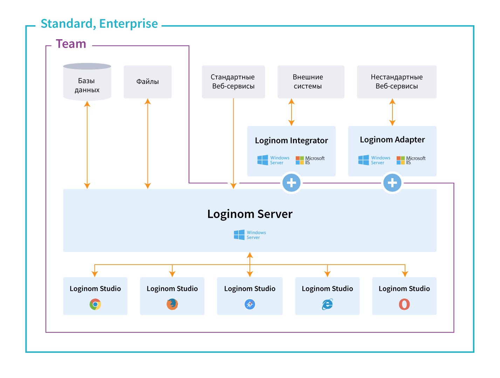

# Loginom Studio

Клиентское веб-приложение, предназначенное для проектирования сценариев обработки, визуализации данных, настройки сервера, управления правами пользователей. Обработка данных выполняется [Loginom Server]()-ом.

**Studio** — основное рабочее место аналитика и конечного пользователя, реализующее пользовательский интерфейс работы с платформой.

Поддерживаются браузеры:

* **Google Chrome**, не ниже 44.0;
* **Mozilla Firefox**, не ниже 57.0;
* **Opera**, не ниже 37.0;
* **Apple Safari**, не ниже 10.3;
* **Microsoft Internet Explorer**, не ниже 11.0;
* **Microsoft Edge**, не ниже 14.0.

Функционал Studio:

* [**Проектирование сценариев**](./scenario/README.md);
* [**Интеграция**](./integration/README.md);
* [**Обработка**](./processors/README.md) и [**визуализация данных**](./visualization/README.md);
* [**Управление файлами**](./location_user_files.md);
* [**Администрирование**](./admin/README.md).

Loginom Studio поставляется в редакциях Team, Standart, Enterprise (см. рисунок 1).

**Рисунок 1. Редакции Loginom, содержащие Studio**

-----

**Смотри также:**

* [Loginom]()