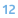

# Вид данных (непрерывный, дискретный)

**Дискретные данные** - данные, число которых конечно или бесконечно, но может быть подсчитано при помощи натуральных чисел от одного до бесконечности. Дискретными являются все данные строкового или логического типа. Дискретными могут быть и числовые данные, например, "Код товара", принимающий значение целого типа, является дискретным, так как арифметические операции над этим показателем не имеют смысла.

**Непрерывные данные** - данные, которые могут принимать любые значения в некотором интервале. Над непрерывными значениями можно проводить арифметические операции, и они имеют смысл.
Примерами непрерывных данных являются: рост, вес, количество товара, прибыль и т.д.

На теблице ниже представлено какой вид данных можно использовать при каждом типе данных.
| Тип данных |  Непрерывный |  Дискретный |
| :- | :-: | :-: |
|  Вещественный | + | + |
|  Целый | + | + |
|  Строковый | | + |
|  Логический | | + |
|  Дата/время | + | + |
