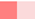

# Информационная панель "Процессы"

Информационная панель предназначена для получения дополнительной информации о процессах обработки данных узлами сценариев в рамках текущей сессии Loginom. В панели иерархически фиксируются процессы и выполняющиеся в них узлы/подузлы, им присваиваются порядковые номера. Каждый новый процесс начинается со строки "Активация узлов", это обусловлено тем, что при старте работы сценария параллельно могут выполняться сразу несколько узлов.

Рисунок 1. Информационная панель "Процессы"

Структура панели следующая:

* № — номер по порядку.
* Процесс — иерархически указаны процессы (наименования) и их составные части. При нажатии на название процесса в сценарии будет найден и выделен узел, который отвечает за его выполнение.
* % — процент выполнения процесса.
* Обработка:
  *  — идет процесс обработки, и время его окончания невозможно рассчитать заранее;
  *  — прогресс выполнения текущего процесса по мере обработки данных;
  *  — успешное выполнение (обработка завершена);
  *  — информация о результатах выполнения процесса еще не получена;
  *  — при выполнении процесса произошла ошибка (обработка не завершена;
  *  — выполнение процесса не начиналось, произошла ошибка.
*  — остановить все процессы.
  *  — остановить конкретный процесс.
*  — удалить все завершенные процессы.
  *  — удалить из списка конкретный процесс.
* Ошибка — указывается текст ошибки в случае ее возникновения. При нажатии на данный текст на экран выведется полная формулировка ошибки.
* Начало — дата и время начала процесса.
* Конец — дата и время окончания процесса.
* Время обработки — разница между началом и концом процесса обработки.

По умолчанию информационная панель скрыта. Ее можно открыть нажатием на кнопку , расположенную в левом нижнем углу.

В информационной панели есть 2 варианта отображения:

1. Показывать только активные процессы и процессы, в которых возникли ошибки. Если в текущий момент времени не выполняется ни один из процессов, а также не было ошибок у процессов завершенных, то в информационной панели данные будут отсутствовать.
2. Отображать все процессы, за исключением тех, которые были удалены пользователем. Для этого необходимо в области панели нажать правой кнопкой мыши и сделать активным пункт меню «Отображать завершенные процессы».

Чтобы при работе со сценарием информационная панель оставалась открытой, ее нужно закрепить нажатием на кнопку , повторное нажатие на  открепляет панель.
Кнопка  панель закрывает.
