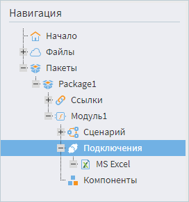
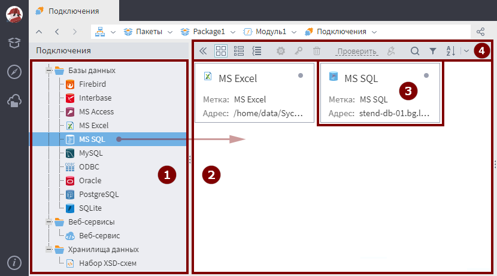

# Подключения

Перед тем как использовать в сценариях узлы [взаимодействия с веб-сервисами](../../processors/integration/calling-web-service.md) и [импорта](../import/README.md)/[экспорта](../export/README.md) из бизнес приложений, хранилищ данных, баз данных или иных источников, в пакете необходимо создать подключение к источнику данных. Подключение содержит в себе все необходимые параметры для соединения с источником данных, такие как пароль/логин, расположение источника и др. Созданное подключение в дальнейшем может использоваться в пакете многократно.

> **Важно:** Для организации подключений к некоторыми источниками, например, к некоторым базам данных, необходимо наличие установленного клиента этой СУБД, либо клиентских библиотек.

## Типы подключений

  * Бизнес приложения
    * [Подключение к 1C:Предприятие 8.x](./list/1c.md)
  * Хранилища данных
    * [Подключение набора XSD-схем](./list/schemes.md)
  * Базы данных
    * [Подключение MS Excel](./list/excel.md)
    * [Подключение Firebird](./list/firebird.md)
    * [Подключение Interbase](./list/interbase.md)
    * [Подключение MS Access](./list/msaccess.md)
    * [Подключение MS SQL](./list/mssql.md)
    * [Подключение MySQL](./list/mysql.md)
    * [Подключение ODBC](./list/odbc.md)
    * [Подключение Oracle](./list/oracle.md)
    * [Подключение PostgreSQL](./list/postgresql.md)
    * [Подключение SQLite](./list/sqlite.md)
  * Веб-сервисы
    * [Подключение веб-сервиса](./list/web-service.md)

## Настройка подключения

Для каждого модуля в составе пакета можно настроить свой список подключений. Для создания/редактирования подключений необходимо отобразить в панели навигации структуру пакета и выбрать пункт "Подключения" соответствующего модуля (см. рисунок 1).

*Рисунок 1. Выбор пункта "Подключения" в панели навигации*

В результате в левой части экрана в виде дерева отобразится перечень возможных для создания подключений (см. рисунок 2 область 1) - дерево классов подключений.

Подключение можно создать двумя способами:

* перетащить нужное подключение из дерева (1) в область подключений (2);
* дважды кликнуть по выбранному подключению в дереве.

В области подключений появится новое подключение (3), и откроется диалог редактирования параметров подключения.

*Рисунок 2. Создание нового подключения*

После того, как требуемые параметры будут заданы, подключение может быть протестировано.

Управление подключениями осуществляется с помощью панели инструментов (4):

*  - показать/скрыть дерево классов подключений;
* /  - тип отображения плитка/таблица;
*  - включение группировки списка по видам подключений;
*  - настроить подключение;
*  - настроить модификатор доступа;
*  - удалить подключение;
*  - активировать подключение.

Навигация по подключениям осуществляется с помощью инструментов:

*  - поиск подключения по имени/пути, возможно искать в разных группах;
*  - фильтрация по группам/меткам/пути подключения;
*  - сортировка.

Также для каждого подключения доступно контекстное меню:

*  - Переименовать подключение;
*  - Настроить подключение;
*  - Настроить [модификатор доступа](../../scenario/access_modifier.md);
*  - Удалить подключение;

* Тестировать подключение;

*  - Активировать подключение.

[Пример подключения и работы с БД](../../quick-start/database.md)
