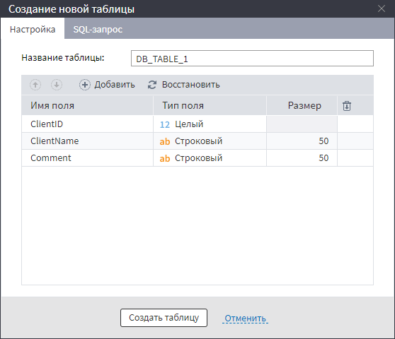
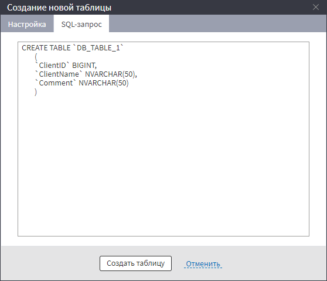

# Создание новой таблицы

Данное окно имеет две вкладки:
* Настройки;
* SQL-запрос.

%spoiler%Пример заполнения:%spoiler%

%/spoiler%

## Настройки

Здесь задаются:
* Название таблицы - уникальное в пределах БД имя таблицы;
* Поля таблицы с указанием следующих параметров:
  * Имя поля в [допустимом формате](../../../data/datasetfieldoptions.md);
  * Тип данных поля;
  * Размер (только для строкового поля) - максимальная длинна строки.

> **Важно:** при превышении максимального значения длины экспортируемой строки возникнет ошибка экспорта.

Для редактирования списка полей используются следующие кнопки:
* / - путем смещения выделенного поля определяется его положение в списке полей создаваемой таблицы;
*  - добавляет новое поле в таблицу;
*  - устанавливает перечень и параметры полей, как в таблице, подключенной к входному порту обработчика;
*  - удаляет все поля в новой таблице.

## SQL-запрос

Данная вкладка позволяет просмотеть вид SQL-запроса, определяющего структуру таблицы.  