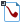

#  Экспорт в LGD-файл

Обработчик осуществляет экспорт исходного набора данных в LGD-файл. LGD-файл уже содержит в себе всю необходимую информацию о параметрах полей (имя поля, метка, тип данных и др.), что позволяет выполнять экспорт и импорт наборов данных с минимальными настройками.

Имеется возможность использования сжатия данных различными алгоритмами.

> **Примечание:** Формат хранения LGD разработан специально для использования с Loginom и обеспечивает наивысшую скорость импорта и экспорта данных.

## Порты

### Вход

*  Подключение (необязательный порт) – используется для указания папки, содержащей экспортируемый файл. Путь к папке задается в подключении "Файлы";
*  Источник данных — таблица данных, подлежащая экспорту;
*  [Управляющие переменные](../../scenario/variables/control-variables.md) (необязательный порт).

## Мастер настройки

* **Хранилище файлов** — выводит информацию о способе подключения к файлу-приемнику.
  * Локальное — через указание пути к файлу-приемнику непосредственно в мастере настройки.
  * Подключение — используется [подключение к папке](../connections/list/files.md), содержащей файл-приемник. Кнопка «Подключить» делает активным это подключение.
* **Имя файла** — задает путь к файлу-приемнику при локальном подключении, либо имя файла при использовании подключения к папке. Кнопка  вызывает диалог выбора файла.
* **Алгоритм сжатия** может применяться для уменьшения размера файла экспорта. Доступны следующие варианты.
  * Без сжатия.
  * [LZO](https://en.wikipedia.org/wiki/Lempel–Ziv–Oberhumer) (рекомендуется, используется по умолчанию).
  * [LZ4](https://en.wikipedia.org/wiki/LZ4_(compression_algorithm)).
* **Разрядность** — выводит информацию о разрядности LGD-файла: 64 или 32 бита. Разрядность LGD-файла зависит от разрядности используемого сервера Loginom.
* **Активация и просмотр** — клик по данной кнопке позволяет сразу в мастере настройки увидеть, как будет выглядеть экспортируемая таблица.

> **Примечание:** Следует учитывать, что Loginom использует формат хранения данных в LGD-файлах отличный от использовавшегося ранее в платформе Deductor файлов DDF. Поэтому эти файлы не могут быть импортированы в Deductor 5.3 и ниже.
