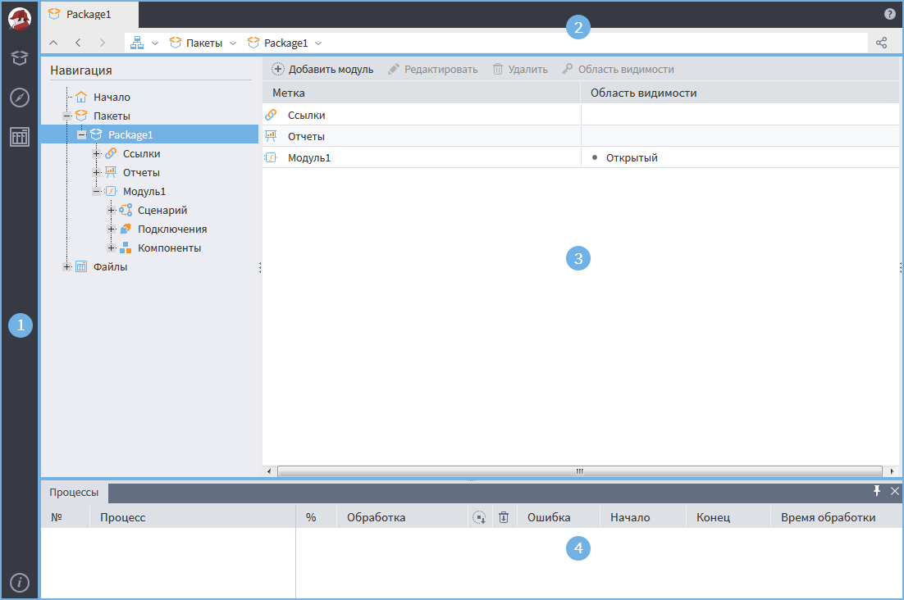
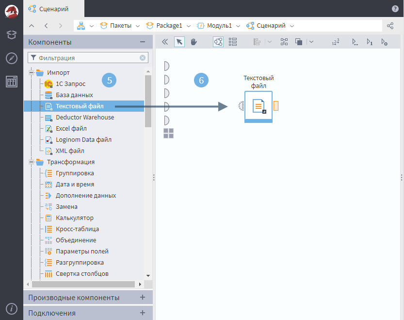

# Интерфейс

Интерфейс Loginom состоит из шести основных блоков (см. Рисунок 1, Рисунок 2):

1. [Главное меню](./main-menu.md);
2. Адресная строка открытой вкладки, содержащая иерархию элементов соответствующей вкладки;
3. Рабочий стол, слева которого отображаются панель навигации, содержащая пакеты и их составные части, а также непосредственно область построения сценария и визуализации данных.
4. [Панель «Процессы»](./information-panel.md). По умолчанию она скрыта, но ее можно открыть, нажав соответствующую кнопку.

    После создания/открытия пакета для построения/корректировки сценариев появляется [рабочее пространство](./workspace.md) (см. Рисунок 2), состоящее из:
5. Панель «Компоненты», содержащая стандартные компоненты, предоставляемые платформой;
6. Область построения сценария — область, в которой располагаются узлы проектируемого сценария и соответствующие связи между ними.

