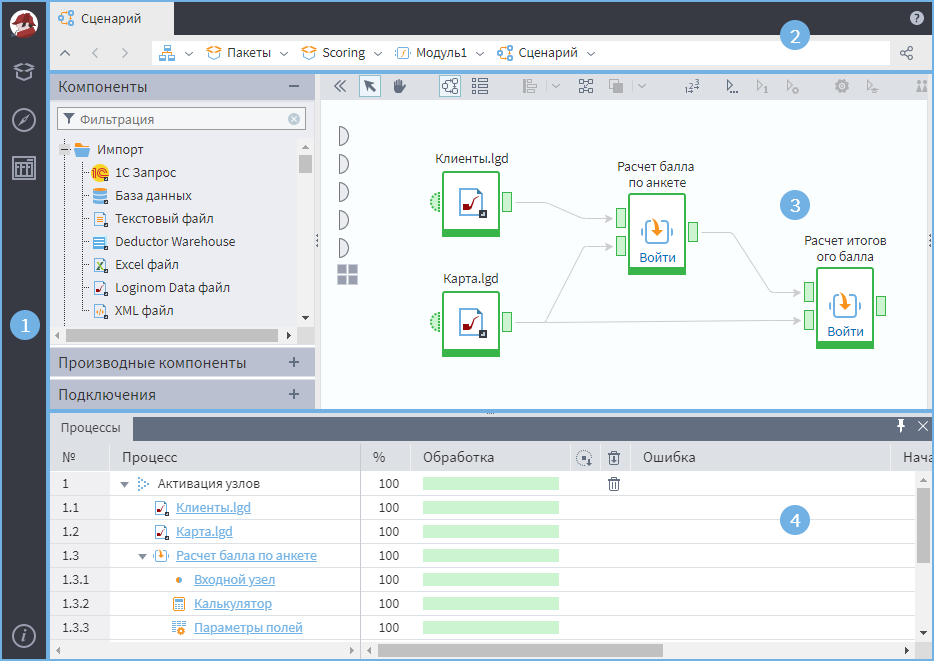

# Интерфейс

После создания или открытия пакета на [cтранице «Начало»](./home-page.md) появится главное рабочее окно программы, состоящее из четырех основных блоков (см. Рисунок 1):

1. [Главное меню](./main-menu.md), содержащее кнопки для манипуляции с различными настройками;
2. [Адресная строка](./addres-bar.md), содержащая путь к открытому объекту;
3. [Рабочее пространство](./workspace.png), содержащее область построения сценария и панель компонентов;
4. [Панель «Процессы»](./processes-panel.md), отображающая подробную информацию о происходящих/происходивших процессах текущей сессии.