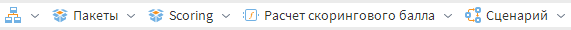
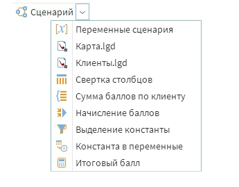
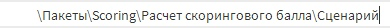

# Адресная строка

Адресная строка — графа, содержащая путь к открытому объекту (см. рисунок 1).

Для удобства в навигации имеется возможность перейти к объекту, содержащемуся в адресной строке, с помощью нажатия на соответствующий объект. Также, нажав на клавишу  можно перейти к подобъектам составного объекта (см. рисунок 2).

При необходимости, можно ввести путь вручную (см. рисунок 3). Для этого необходимо нажать на адресную строку и ввести новый/скорректированный путь.

