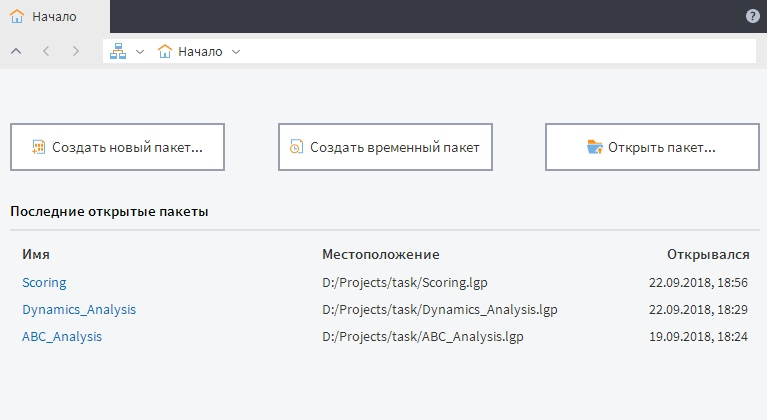

# Страница «Начало»

После открытия приложения, в случае десктопной версии Loginom, или авторизации, в случае серверной версии Loginom, появляется **страница «Начало»** (см. Рисунок 1).

Данная страница содержит следующие команды для манипуляции с [пакетами](../quick-start/package.md):
* **Создать новый пакет**, позволяющая создать и сохранить новый пакет;
* **Создать временный пакет**, позволяющая создать временный пакет и работать с ним, не сохраняя его;
* **Открыть пакет**, позволяющая открыть существующий пакет.

Ниже расположена графа **Последние открытые пакеты**, включающая в себя историю открытия пакетов со следующими полями:
* **Имя** — файл пакета;
* **Местоположение** — место файла пакета на диске (настольная версия) или в [файловом хранилище](../location_user_files.md) (серверная версия);
* **Открывался** — дата и время открытия пакета.