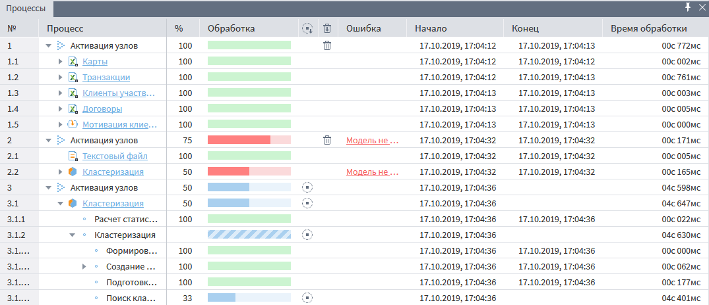

# Информационная панель «Процессы»

Информационная панель предназначена для получения дополнительной информации о процессах обработки данных узлами сценариев в рамках текущей сессии Loginom. В панели иерархически фиксируются процессы и выполняющиеся в них узлы/подузлы, им присваиваются порядковые номера. Каждый новый процесс начинается со строки "Активация узлов", это обусловлено тем, что при старте работы сценария параллельно могут выполняться сразу несколько узлов.

Структура панели следующая:

* № — номер по порядку.
* Процесс — иерархически указаны процессы (наименования) и их составные части. При нажатии на название процесса в сценарии будет найден и выделен узел, который отвечает за его выполнение.
* % — процент выполнения процесса.
* Обработка:
  *  — идет процесс обработки, и время его окончания невозможно рассчитать заранее;
  *  — прогресс выполнения текущего процесса по мере обработки данных;
  *  — успешное выполнение (обработка завершена);
  *  — информация о результатах выполнения процесса еще не получена;
  *  — при выполнении процесса произошла ошибка (обработка не завершена);
  *  — выполнение процесса не начиналось, произошла ошибка.
*  — остановить все процессы.
  *  — остановить конкретный процесс.
*  — удалить все завершенные процессы.
  *  — удалить из списка конкретный процесс.
* Ошибка — указывается текст ошибки в случае ее возникновения. При нажатии на данный текст на экран выведется полная формулировка ошибки.
* Начало — дата и время начала процесса.
* Конец — дата и время окончания процесса.
* Время обработки — разница между началом и концом процесса обработки.

При выборе процесса на информационной панели можно вызвать контекстное меню, содержащее следующие действия:

*  Отменить — останавливает выполнение выбранного процесса.
*  Отменить выполнение всех процессов... — останавливает выполнение всех процессов.
*  Удалить из списка — удаляет процесс из списка информационной панели.
*  Удалить все заверенные процессы... — удаляет все завершенные процессы из списка информационной панели.
* Показать узел — выделяет выбранный узел на Области построения сценариев.
* Подробнее — выводит на экран сообщение об ошибке передаваемое узлом.
* Отображать завершенные процессы — изменяет отображение процессов на панели:
  * При наличии  отображает все процессы, за исключением тех, которые были удалены пользователем.
  * При отсутствии   показывает только активные процессы и процессы, в которых возникли ошибки. Если в текущий момент времени не выполняется ни один из процессов, а также не было ошибок у процессов завершенных, то в информационной панели данные будут отсутствовать.

По умолчанию информационная панель скрыта. Ее можно открыть нажатием на кнопку , расположенную в левом нижнем углу. Чтобы при работе со сценарием информационная панель оставалась открытой, ее нужно закрепить нажатием на кнопку , повторное нажатие на  открепляет панель.
Кнопка  панель закрывает.
