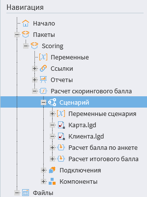

# Главное меню

Главное меню расположено в левой части программного окна и содержит следующие кнопки:
* **Меню**;
* **Пакеты**;
* **Навигация**;
* [Администрирование](../admin/README.md);
* [Файлы](../location_user_files.md);
* [Процессы](./processes-panel.md).

## Меню

Нажав на данную кнопку, можно увидеть следующие команды и информацию:
      
* **Имя пользователя**, под которым открыта текущая сессия (в случае серверной версии Loginom);
* **Начало** — переход на [страницу «Начало»](./home-page.md);
* **Справка** — вызов справки;
* **Выход** для закрытия всех пакетов и выхода из приложения;
* **Текущую версию приложения**;
* **Проверить наличие обновления** — проверка актуальных версий платформы на сайте разработчика.

## Пакеты

Нажав на данную кнопку, можно увидеть следующие команды:

* **Создать новый** для создания нового;
* **Создать временный** для создания временного пакета, не сохраняя его;
* **Открыть для открытия** существующего пакета;
* **Сохранить** для сохранения пакета или его изменений в текущей директории;
* **Сохранить как** для сохранения пакета в выбранной директории;
* **Закрыть пакет** для закрытия открытого пакета.

>**Примечание:** Команды **Сохранить**, **Сохранить как**, **Закрыть пакет** доступны в том случае открытого пакета.

## Навигация

Данная кнопка отрывает древовидную структуру пакета, позволяющая быстро перемещаться по составным объектам соответствующего пакета (см. Рисунок 1).

