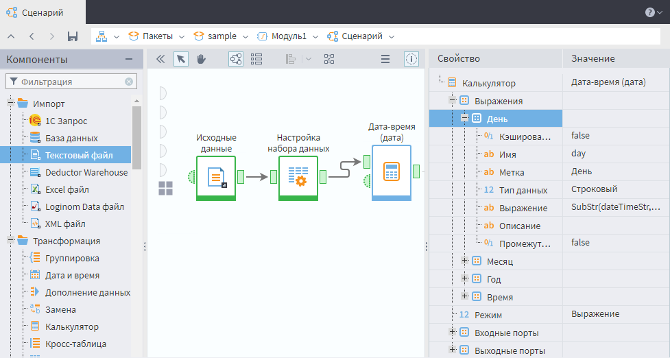

# Инспектор свойств
*Инспектор свойств* предназначен для получения информации о свойствах узла сценария.

Окно *Инспектора свойств* расположено в правой части экрана на страницах *Сценарий* и *Подключения* и по умолчанию находится в свернутом состоянии.

Чтобы посмотреть свойства узла, необходимо его выделить и нажать на кнопку  на панели инструментов или в контекстном меню выставить флаг  **Показать/скрыть инспектор свойств** (поставить галочку).

> **Примечание:** Кнопка   всегда находится в крайней правой позиции на панели инструментов.

На рисунке представлен фрагмент сценария с открытым окном *Инспектора свойств* для узла *Калькулятор*:

Свойства узла (метки свойств) отображаются в виде дерева.

Корень дерева в *Инспекторе свойств* содержит имя узла (название компонента), а в колонке *Значение* для него выводится метка узла. Корневой узел дерева свойств всегда находится в раскрытом состоянии, его нельзя свернуть.

> **Примечание:** Порядок колонок *Свойство* и *Значение* изменить нельзя.

Узлы в дереве *Инспектора свойств* можно сортировать, для этого нужно кликнуть мышью на заколовок колонки *Свойство*. Последовательное нажатие на заголовок меняет порядок сортировки или отменяет его.

Любую ячейку или диапазон ячеек *Инспектора свойств* можно выделить указателем мыши и скопировать ее (их) значение, нажав сочетание клавиш *Ctrl+C*.

Для ячеей, в которых текст полностью не помещается, предусмотрены всплывающие подсказки.

Контекстное меню *Инспектора свойств* содержит команды:

*  **Развернуть** - разворачивает узел дерева.

*  **Свернуть** - сворачивает узел дерева.

*Инспектор свойств* реагирует на изменение узла - полностью перечитывает дерево свойств.

> **Важно:** Если узел заблокирован (узел выполняется или открыт мастер настройки узла), то его свойства посмотреть нельзя. Для такого узла в *Инспекторе свойств* будет выведено сообщение: "Узел заблокирован, попробуйте позже".

Если не выбран ни один узел или выбрано несколько узлов, то в *Инспекторе свойств* будет приглашение "Выделите узел, чтобы посмотреть его свойства".

 
