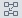
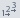
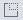

# Рабочее пространство
Рабочее пространство состоит из панели компонентов, области построения сценария и панели инструментов (см. Рисунок 1).

Cлева находится панель компонентов, состоящая из следующих категорий:

* Компоненты — стандартная библиотека базовых компонентов Loginom;
* [Производные компоненты](../scenario/derived-component.md) — создаваемые пользователями компоненты на основе базовых;
* [Подключения](../integration/connections/readme.md) — источники данных.

По центру расположена область построения сценария, полотно, содержащее узлы сценария и связи между ними.  

Сверху расположена панель инструментов, содержащая следующие операции для манипуляции с областью построения и ее составляющими:
* Показать/Скрыть панель компонентов — позволяет открыть или закрыть панель компонентов;
* Режим выбора объекта — режим, использующийся для построения сценария с помощью стандартных манипуляций;
* Режим навигации по сценарию — режим, использующийся для навигации по области построения сценария с помощью мышки;
* Показать в виде сценария — отображает сценарий  в стандартном виде (в виде направленного графа);
* Показать в виде таблицы — компактное отображание сценария в виде таблицы, содержащей используемые элементы;
* Вертикальное выравнивание — позволяет выравнить вертикально узлы сценария на области построения. имеются следующими виды вертикального выравнивания:
  * По левому краю;
  * По середине;
  * По правому краю;
  * По верхнему краю;
  * По центру;
  * По нижнему краю.
*  Автоматическое упорядочивание узлов — автоматическое расположение узлов на области сценария в соответствии с их последовательностью обработки данных;
* Переместить выделенные узлы — выставляет выделенные узлы и их подписи на:
  * Передний план;
  * Задний план.
* Настроить порядок выполнения — позволяет задать собственный порядок выполенения узлов (см. [Управление ходом выполнения сценария](../scenario/run-order.md));
* Выполнить все — выполнить все выделенные узлы сценария;
* Активировать/Деактивировать узел — активировать/деактивировать узел;
* Переобучить узел — переобучает выделенный узел (см. [Обучение узла](../scenario/training-processors.md));
* Настроить узел — заходит в настройки выделенного узла;
* Настроить режим активации узла — настройка режима активации выделенного узла ([см. Режим активации узла](../scenario/setting-batch-processing-mode.md));
* Клонировать узел — клонирование выделенного узла;
* Развернуть/Свернуть подмодель — позволяет свернуть выделенные узлы в подмодель или развернуть выделенную подмодель на составные узлы (см. [Подмодель](../processors/control/submodel.md));
* Удалить выбранное — удаляет выделенные элементы сценария (узлы, связи);
* Создать производный компонент — создает производный компонент на основе выделенного узла;
* Показать родительские узлы для производных — при наличии производных узлов показывает родительские узлы;
* Показать исходные узлы для Узлов-ссылок — при наличии Узлов-ссылок показывает узлы, на основе которых они создавались (см. [Узел-Ссылка](../processors/control/unit-link.md));
* Показать карту сценария — для навигации открывается уменьшенная копия области построения сценария.