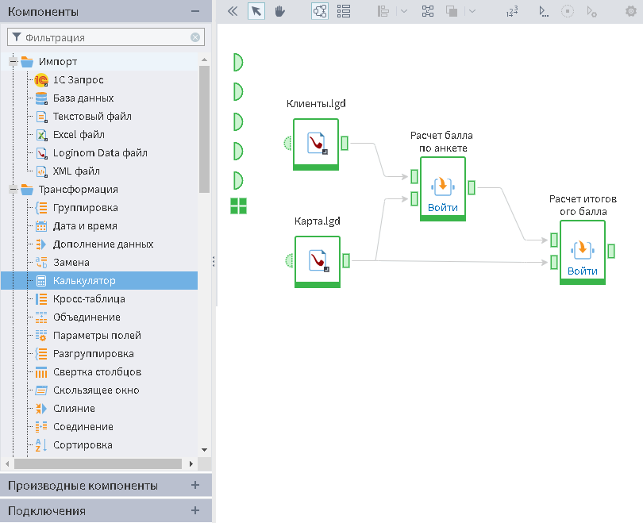

# Рабочее пространство
Рабочее пространство состоит из панели компонентов, области построения Сценария и панели инструментов (см. рисунок 1).

Cлева находится панель компонентов, состоящая из следующих категорий:

* Компоненты — стандартная библиотека базовых компонентов Loginom;
* [Производные компоненты](../scenario/derived-component.md) — создаваемые пользователями компоненты на основе базовых;
* [Подключения](../integration/connections/README.md) — источники данных.

По центру расположена область построения Сценария — полотно, содержащее узлы Сценария и связи между ними.  

Сверху расположена панель инструментов, содержащая следующие операции для манипуляции с областью построения и ее составляющими:
*  Показать/ Скрыть панель компонентов — позволяет открыть или закрыть панель компонентов;
*  Режим выбора объекта — режим, использующийся для построения Сценария с помощью стандартных манипуляций;
*  Режим навигации по сценарию —  режим, использующийся для перемещения по области построения Сценария с помощью мышки;
*  Показать в виде сценария — отображает Сценарий  в стандартном виде (в виде направленного графа);
*  Показать в виде таблицы — компактное отображение Сценария в виде таблицы, содержащей используемые элементы;
* Вертикальное/Горизонтальное выравнивание — позволяет выровнять узлы Сценария на области построения. Данное действие доступно для выделенных узлов. Имеются следующие виды выравнивания:
    *  По левому краю;
    *  По середине;
    *  По правому краю;
    *  По верхнему краю;
    *  По центру;
    *  По нижнему краю.
*  Автоматическое упорядочивание узлов — автоматическое расположение узлов на области Сценария в соответствии с их последовательностью обработки данных;
*  Переместить выделенные узлы — выставляет выделенные узлы и их подписи на:
  * Передний план;
  * Задний план.
*  [Настроить порядок выполнения](../scenario/run-order.md) — позволяет задать собственный порядок выполнения узлов;
*  Выполнить все — выполнить все узлы Сценария;
*  Активировать/ Деактивировать узел;
*  [Переобучить узел](../scenario/training-processors.md);
*  Настроить узел — заходит в настройки выделенного узла;
*  [Настроить режим активации узла](../scenario/setting-batch-processing-mode.md);
*  Вырезать — копирует данные в оперативную память с одновременным их удалением с места текущего расположения;
*  Копировать — помещает копию выделенных данных в буфер обмена;
*  Вставить — вставляет содержимое буфера обмена в место назначения;
*  Клонировать узел — клонирование выделенного узла с сохранением настроек и связей, идущих к нему;
*  Развернуть/Свернуть [подмодель](../processors/control/submodel.md) — позволяет свернуть выделенные узлы в Подмодель или развернуть выделенную Подмодель на составные узлы;
*  Удалить выбранное — удаляет выделенные узлы/связи Сценария;
*  Создать производный компонент — создает Производный компонент на основе выделенного узла;
*  Показать родительские узлы для производных — при наличии производных узлов показывает родительские узлы;
*  Показать исходные узлы для [Узлов-ссылок](../processors/control/unit-link.md) — при наличии Узлов-ссылок показывает узлы, на основе которых они создавались;
*  Показать карту сценария — для навигации открывается уменьшенная копия области построения Сценария с возможностью масштабирования;
*  Показать/скрыть [инспектор свойств](../interface/property-inspector.md) — разворачивает/сворачивает окно *Инспектора свойств*. Эта кнопка всегда находится в крайней правой позиции на  панели инструментов.

> **Примечание:** при открытом окне *Инспектора свойств* часть кнопок на панели инструментов может не помещаться. В этом случае на панели инструментов появляется кнопка  с выпадающим списком,  в котором будут находиться все непоместившиеся на панели кнопки.