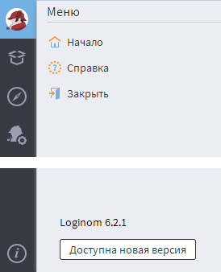
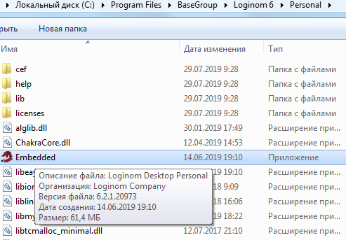
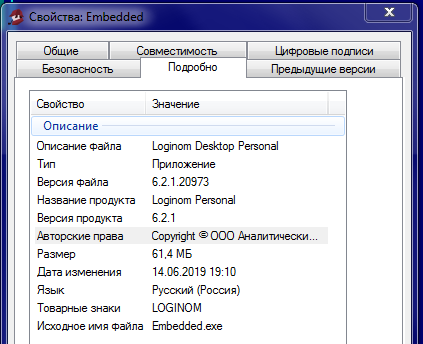
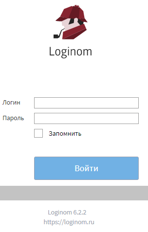
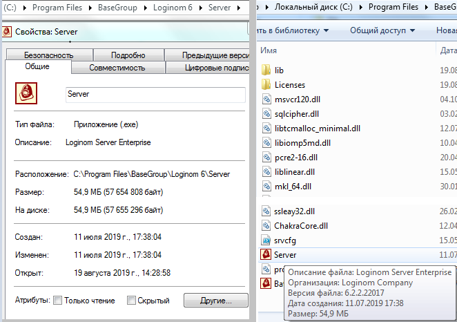

# Где и как смотреть версию ПО Loginom

Версию ПО Loginom, предназначенного для автономной обработки данных (__редакции Academic и Personal__), можно посмотреть следующими способами:

* в Меню программы Loginom;
* в Проводнике OC Windows;
* в Свойствах приложения Loginom.

Рассмотрим каждый вариант.

## В Меню программы Loginom

Для использования данного варианта необходимо запустить программу Loginom, кликнуть на иконку Меню в левом верхнем углу, и тогда в нижнем левом углу появится номер версии:

## В Проводнике OC Windows

Чтобы посмотреть номер версии ПО в Проводнике, необходимо навести указатель мышки на интересующее нас приложение (в данном случае это – C:\Program Files\BaseGroup\Loginom 6\Personal\Embedded.exe). В появившемся окошке будет содержаться информация о приложении, включая номер версии:

## В Свойствах приложения Loginom

Чтобы посмотреть номер версии ПО в Свойствах приложения, необходимо доступным способом открыть окно со свойствами интересующего нас приложения (в данном случае это – C:\Program Files\BaseGroup\Loginom 6\Personal\Embedded.exe) и в закладке Подробно получить интересующую информацию:

 

Версию ПО Loginom, предназначенного для коллективной обработки данных в серверном режиме (__редакции Team, Standard и Enterprise__), можно посмотреть следующими способами:

* на стартовой странице клиентского места Loginom;
* в Меню клиентского места Loginom;
* на сервере Loginom в Проводнике OC Windows;
* на сервере Loginom в Свойствах приложения Loginom.

Рассмотрим каждый вариант.

## На стартовой странице клиентского места Loginom

При открытии стартовой страницы клиентского места Loginom еще до введения логина/пароля в нижнем левом углу будет содержаться номер версии:

## В Меню клиентского места Loginom

Для использования этого варианта необходимо после авторизации клиентского места Loginom кликнуть на иконку Меню в левом верхнем углу, и тогда в нижнем левом углу появится номер версии:

## На сервере Loginom в Проводнике OC Windows и в Свойствах приложения Loginom

Данные варианты аналогичны способам, описанным для десктопных редакций, за исключением того, что для удаленного подключения к файловой системе сервера Loginom пользователю необходимы права администратора, и собственно интересующее приложение Loginom – это сервер (C:\Program Files\BaseGroup\Loginom 6\Server\Server.exe):

