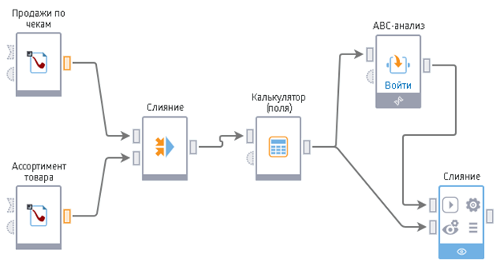

# Обработка

## Основные понятия

**Сценарий** - последовательность действий, которые необходимо провести для анализа данных. Сценарий обработки представляет собой комбинацию узлов обработки данных, настраиваемую пользователем для решения конкретной задачи.

Последовательность обработки задается соединением выхода предыдущего узла сценария со входом последующего. Входом и выходом узла являются **входные** и **выходные порты**.

 *Пример сценария*

**Узел** сценария выполняет отдельную операцию над данными. Перечень возможных операций представлен палитрой готовых **компонентов**. Таким образом, **компонент** является прообразом или шаблоном будущего узла сценария. Для того, чтобы создать узел сценария, выполняющий нужную операцию над данными, необходимо мышью перенести соответствующий компонент из панели компонентов в область построения сценария (подробнее см. ["Первый сценарий"](../quick-start/first-scenario.md)).

Узлы сценария создаются из компонентов 2-х типов:

* Стандартные компоненты - предоставляются в рамках платформы;
* [Производные компоненты](../scenario/derived-component.md) - создаются и настраиваются пользователем. Производный компонент можно создать из комбинации узлов сценария, реализующей произвольную логику обработки.

Таким образом набор средств для реализации различной логики обработки данных не ограничивается стандартными компонентами платформы и может быть расширен самим пользователем.

Чаще всего для создания производного компонента используется [Подмодель](../processors/control/submodel.md). Подмодель является специальным узлом, способным включать в себя другие узлы сценария. Реализованная в Подмодели логика может быть произвольной, при этом разработчик сценария может рассматривать её как «черный ящик».

Подмодель принимает информацию через входные порты, производит обработку и выдает результат на выходные порты. Входные и выходные порты задаются пользователем.

От обработчика к обработчику могут передаваться как наборы данных - таблицы, так и переменные - объекты, содержащие лишь одно значение. Статистические данные таблиц (например, сумма по столбцу, среднее значение и т.д.) при помощи специального обработчика могут быть преобразованы в переменные.

Переменные, в свою очередь, могут применяться в обработчиках для преобразования таблиц. Поскольку таблицы и переменные имеют разную структуру, то соответствующие им порты не могут быть соединены друг с другом и имеют разное обозначение.

## Стандартные компоненты

### [Трансформация](./transformation/README.md)

Набор компонентов для первоначальной подготовки и простой обработки исходных наборов данных. 

* [Группировка](../processors/transformation/grouping.md)
* [Дата и время](../processors/transformation/trans-datatime.md)
* [Дополнение данных](../processors/transformation/supplementation.md)
* [Замена](../processors/transformation/substitution.md)
* [Калькулятор](../processors/transformation/calc.md)
* Калькулятор JS
* [Кросс-таблица](../processors/transformation/cross-table.md)
* [Объединение](../processors/transformation/union.md)
* [Параметры полей](../processors/transformation/fields-parameters.md)
* [Разгруппировка](../processors/transformation/ungrouping.md)
* [Свёртка столбцов](../processors/transformation/rollup-columns.md)
* [Скользящее окно](../processors/transformation/sliding-window.md)
* [Слияние](../processors/transformation/join/README.md)
* [Соединение](../processors/transformation/addition.md)
* [Сортировка](../processors/transformation/sorting.md)
* [Фильтр строк](../processors/transformation/row-filter.md)

### [Управление](./control/README.md)

Компоненты группы предназначены для оптимизации сценариев путем создания подмоделей и повторного использования узлов, а также формирования логики выполнения сценариев при помощи условий и циклов.

* [Выполнение узла](../processors/control/execute-node.md)
* [Подмодель](../processors/control/submodel.md)
* [Узел-ссылка](../processors/control/unit-link.md)
* [Условие](../processors/control/condition.md)
* [Цикл](../processors/control/cycle.md)

### [Исследование](./scrutiny/README.md)

С помощью этих обработчиков можно оценить и/или визуализировать структуру и статистические характеристики данных. Также с их помощью проводятся разведочный и описательный анализы.

* [Автокорреляция](../processors/scrutiny/autocorrelation.md)
* [Корреляционный анализ](../processors/scrutiny/correlation-analysis.md)
* [Факторный анализ](../processors/scrutiny/factor-analysis.md)

### [Предобработка](./preprocessing/README.md)

Предварительная обработка данных для их дальнейшего использования в алгоритмах Data Mining. Применяются такие методы, как заполнение пропусков, сэмплинг, редактирование выбросов и другие.

* [Заполнение пропусков](../processors/preprocessing/filling-omissions.md)
* [Квантование](../processors/preprocessing/quantization.md)
* [Конечные классы](../processors/preprocessing/fine-classes.md)
* [Разбиение на множества](../processors/preprocessing/separating-to-multiplicity.md)
* [Редактирование выбросов](../processors/preprocessing/editing-of-emissions.md)
* [Сглаживание](../processors/preprocessing/smoothing.md)
* [Сэмплинг](../processors/preprocessing/sampling.md)

### [Data Mining](./datamining/README.md)

Обработчики, выделенные в эту группу, являются инструментами для реализации различных методов Data Mining: кластеризация, ассоциативные правила и другие.

* [EM Кластеризация](../processors/datamining/em-clustering.md)
* [Ассоциативные правила](../processors/datamining/associative-rules.md)
* [Кластеризация](../processors/datamining/clustering.md)
* [Кластеризация транзакций](../processors/datamining/clustering-transactions.md)
* [Логистическая регрессия](../processors/datamining/logistic-regression.md)
* [Нейросеть (классификация)](../processors/datamining/neural-network-classification.md)
* [Нейросеть (регрессия)](../processors/datamining/neural-network-regression.md)
* [Самоорганизующиеся сети](../processors/datamining/self-organizing-network.md)

### Переменные

В Loginom имеется возможность создавать и использовать переменные. Обработчики этой группы позволяют проводить различные операции над ними: изменение, создание переменных из таблицы, расчет новых переменных с помощью различных функций.

* [Замена (переменные)](../processors/variables/variable-replace.md)
* [Калькулятор (переменные)](../processors/variables/variables-calc.md)
* [Переменные в таблицу](../processors/variables/variables-table.md)
* [Соединение (переменные)](../processors/variables/variables-union.md)
* [Таблица в переменные](../processors/variables/table-variables.md)
