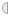
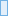
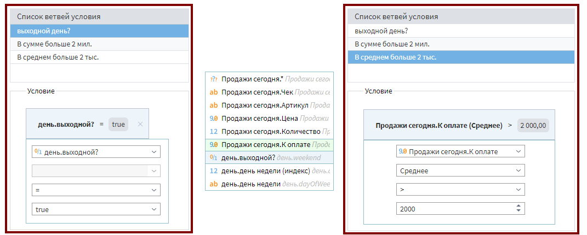
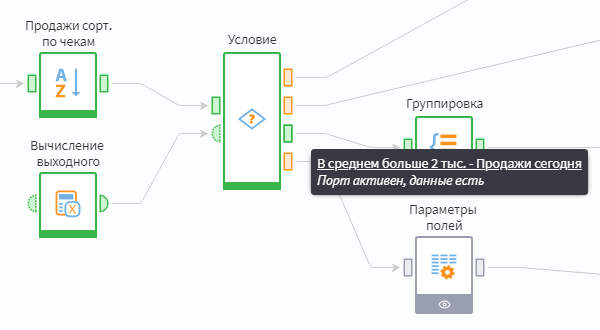

#  Условие

Компонент используется в точке разветвления сценария в качестве переключателя. В соответствии с заданными ему условиями выполняется только одна ветвь сценария и блокируется выполнение всех остальных.

Выявление активной ветви происходит по следующему принципу:

1. Ветви проверяются на истинность последовательно по списку сверху вниз, начиная с самой первой;
1. При выявлении ветви со значением "истина" проверка останавливается, ветвь становится активной, а остальные блокируются, даже если ниже по списку остались истинные;
1. Если все ветви примут значение "ложь", то будет активизирована специальная ветвь *Иначе*.

## Порты

Изначально входных и выходных [портов](../../scenario/ports/README.md) нет, они создаются пользователем в мастере настройки. Порты могут быть следующих типов:

### Вход

*  **Входные переменные** — набор переменных;
*  **Входной источник данных** — таблица данных.

### Выход

*  **Выходные переменные** — набор переменных;
*  **Выходной набор данных** — таблица данных.

## Мастер настройки

### Шаг 1. Настройка портов узла

Здесь задается наличие необходимых портов. Каждому порту можно задать тип, имя и название, которое будет отображаться при наведении курсора на него.

*  **Добавить** — создать новый порт входа:
  *  **Переменные** — для переменных.
  *  **Таблица** — для таблицы.
*  **Переместить вниз**,  **Переместить вверх** — путем смещения выделенного порта определить его положение относительно узла компонента.
*  **Редактировать** — редактировать параметры порта.
*  **Передавать на выход** — для выделенного входного порта будет создан порт выхода в каждой ветви.
*  — удалить порт.
*  — удалить все порты.

### Шаг 2. Настройка списка условий

**Список ветвей условия** — содержит варианты дальнейшего выполнения сценария.

*  **Добавить** — добавить новую ветвь условия;
*  **Переместить вниз**,  **Переместить вверх** — установить приоритет выделенной ветви путем её смещения относительно других ветвей;
*  — удалить ветвь;
*  — удалить все ветви условий.

**Условие** — область конфигурации условий для конкретной ветви, отображается при выделении ветви в списке.

*  — добавить в ветвь новое условие, после нажатия открывается окно для его настройки:
  * **Поле** — содержит список всех переменных, столбцов таблиц и указатель записей таблиц, поданных на входные порты компонента. Выбранный объект будет использован для сравнения.
  * **Агрегация** — содержит список методов [агрегации](../func/aggregation-functions.md), применимых к полям таблиц. Список недоступен для полей-переменных.
  * **Условие** — выбор метода сравнения.
  * **Сравниваемое значение** — значение, с которым будет сравниваться выбранный объект.
* **И/ИЛИ** — кнопка-переключатель появляется между двумя условиями в ветви:
  * **И** — связываемые условия дадут значение "истина", если они оба истинны.
  * **ИЛИ** — связываемые условия дадут значение "истина", если истинно хотя бы одно из них.
*  **Удалить все условия** — удалить все условия для выбранной ветви.

> Примечание: Условие проверяется на атомарных значениях, например "A > 1". Таким значением может быть переменная. Если же на вход подана таблица, то поле обозначает не одно значение, а целую колонку. В этом случае данную колонку необходимо свети к одному значению с помощью методов агрегации.

**Режим отладки**  — применяется для проверки корректности данных на выходных портах вне зависимости от условий. Активны будут ветви, указанные в списке *Выполнять ветвь условия*, который включает в себя:

* **Список пользовательских ветвей** — добавленные пользователем ветви, можно выбрать одну из них;
* **Все ветви** — активирует выполнение всех ветвей, в том числе ветвь *Иначе*;
* **Иначе** — активирует выполнение только ветви *Иначе*.

%spoiler%Пример:%spoiler%

Пусть у нас есть таблица продаж на конкретную дату (например, сегодня). Нам нужны три сценария обработки данных, которые зависят от дня недели (выходной) или от выручки (суммарной или средней). Для этого мы подадим на вход узла *Условие* таблицу (назовем ее "продажи сегодня") и список переменных (назовем список "день"), обозначающих день и его параметры. На выходе нас интересует лишь таблица продаж.

Пример исходной таблицы:

| Чек | Артикул | Цена, руб. | Количество | К оплате, руб. |
| :---: | :----: | ------: |------: |------: |
| ... | ... | ... | ... | ... |
| CH1903001598 | ART01001308 | 3 408 | 1 | 3 408 |
| CH1903001599 | ART01001309 | 2 459 | 2 | 4 918 |
| CH1903001600 | ART01002018 | 1 467 | 1 | 1 467 |
| CH1903001601 | ART01001752 |   492 | 4 | 1 968 |
| ... | ... | ... | ... | ... |

Пример настройки ветвей на основе переменных либо таблицы с агрегацией по среднему значению:

Отработка разветвления сценария:

В данном случае сработала третья ветвь и дальнейшее выполнение сценария будет идти через нее.

%/spoiler%
