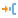
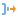

# Подмодель

## Описание

Подмодель является специальным узлом, способным включать в себя другие узлы сценария. Реализованная в подмодели с помощью вложенных узлов логика может быть произвольной. Подмодель принимает информацию через входные порты, производит обработку и выдает результат на выходные порты. Перечень входных и выходных портов задается пользователем произвольно, исходя из закладываемой в подмодель функциональности.

В состав подмодели могут также включаться другие подмодели, их вложенность друг в друга неограниченна. Подмодели используются для декомпозиции сценария и создания [производных компонентов](../../app/glossary/derived_component.md).

## Порты

Изначально входных и выходных портов нет, они создаются пользователем в мастере настройки. Порты могут быть следующих типов:
### Вход

 *  Входные переменные - набор переменных.

 * .

### Выход

 *  Выходные переменные - набор переменных.

 * .

## Мастер настройки

Здесь создаются порты. Каждому порту можно задать тип, имя и метку, которая будет отображаться при наведении курсора на него.

*    **Входы**   - создать новый порт входа:
    *  - для переменных;
    *  - для таблицы.

*    **Выходы**   - создать новый порт выхода:
    *  - для переменных;
    *  - для таблицы.

*    - сместить выделенный порт в списке;

*   - удалить порт;

*   - удалить все порты.

## Область построения подмодели

Узел подмодели имеет кнопку "Войти", при нажатии которой можно открыть область построения подмодели и реализовать в ней произвольный сценарий обработки. При редактировании содержимого подмодели ее входные и выходные порты, созданные в мастере настройки, отображаются по левому и правому краю области над кнопками  "Выходной узел". 

Внутри подмодели имеется возможность использовать [переменные сценария](../../app/glossary/variables/scenario_variables.md), в состав которых входят "Переменные пользователя". Пользователь имеет возможность задать перечень и значения переменных пользователя, при этом область их применения ограничена подмоделью.

По нажатию кнопки  "Выйти из подмодели" область построения подмодели можно покинуть, вернувшись в сценарий уровнем выше.

