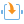
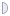
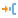
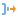
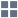

#  Подмодель

## Описание

Подмодель является специальным узлом, способным включать в себя другие узлы сценария. Реализованная в подмодели с помощью вложенных узлов логика может быть произвольной. Подмодель принимает информацию через входные порты, производит обработку и выдает результат на выходные порты. Перечень входных и выходных портов задается пользователем произвольно, исходя из закладываемой в подмодель функциональности.

В состав подмодели могут также включаться другие подмодели, их вложенность друг в друга неограниченна. Подмодели используются для декомпозиции сценария и создания [производных компонентов](../../scenario/derived_component.md).

## Порты

Изначально входных и выходных портов нет, они создаются пользователем в мастере настройки. Порты могут быть следующих типов:

### Вход

*  Входные переменные - набор переменных.
*  Входной источник данных (таблица данных).

### Выход

*  Выходные переменные - набор переменных.
*  Выходной набор данных (таблица данных).

## Мастер настройки

Здесь создаются порты. Каждому порту можно задать тип, имя и метку, которая будет отображаться при наведении курсора на него.

*   **Входы**  - создать новый порт входа:
  *  - для переменных;
  *  - для таблицы.

*   **Выходы**  - создать новый порт выхода:
  *  - для переменных;
  *  - для таблицы.

*   - сместить выделенный порт в списке;

*  - удалить порт;

*  - удалить все порты.

## Область построения подмодели

Узел подмодели имеет кнопку "Войти", при нажатии которой можно открыть область построения подмодели и реализовать в ней произвольный сценарий обработки. При редактировании содержимого подмодели ее входные и выходные порты, созданные в мастере настройки, отображаются по левому и правому краю области над кнопками   «Входной узел» и  "Выходной узел".

Внутри подмодели имеется возможность использовать [переменные сценария](../../scenario/variables/scenario_variables.md), в состав которых входят "Переменные пользователя". Пользователь имеет возможность задать перечень и значения переменных пользователя, при этом область их применения ограничена подмоделью.

По нажатию кнопки  "Выйти из подмодели" область построения подмодели можно покинуть, вернувшись в сценарий уровнем выше.
