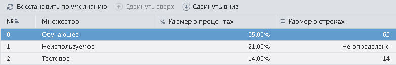

#  Логистическая регрессия

## Описание

[Логистическая регрессия](https://wiki.loginom.ru/articles/logistic-regression.html) — это разновидность множественной регрессии, общее назначение которой состоит в анализе связи между несколькими [независимыми переменными](https://wiki.loginom.ru/articles/input-variable.html) и [зависимой переменной](https://wiki.loginom.ru/articles/output-variable.html).

С помощью логистической регрессии можно оценивать вероятность того, что событие наступит для конкретного испытуемого (больной/здоровый, возврат кредита/дефолт и т.д.).

>**Важно:** входные данные никогда не должны содержать пропусков, выходные данные не должны содержать пропусков во время обучения.

## Порты

### Вход

*  Входной источник данных (таблица данных).

### Выходы

*  Выход регрессии (таблица данных);
*  [Коэффициенты регрессионной модели](./coef-regression.md) (таблица данных);
*  [Сводка](./report.md) (переменные).

## Мастер настройки узла

Включает следующие группы параметров:

* Настройки [нормализации](../../normalization/README.md);
* [Разбиение на множества](#razbienie-na-mnozhestva);
* [Настройка логистической регрессии](#nastroyka-logisticheskoy-regressii);
* [Детальные настройки](#detalnye-nastroyki) (включаются, если выбран соответствующий флажок в настройках логистической регрессии).

### Разбиение на множества

Страница "Разбиение на множества" мастера настройки узла позволяет разделить множество на обучающее и тестовое.

* [Обучающее](https://wiki.loginom.ru/articles/training-set.html) — cтруктурированный набор данных, применяемый для обучения аналитических моделей. Каждая запись обучающего множества представляет собой обучающий пример, содержащий заданное входное воздействие и соответствующий ему правильный выходной (целевой) результат;
* [Тестовое](https://wiki.loginom.ru/articles/test-set.html) — подмножество обучающей выборки, содержащее тестовые примеры, т.е. примеры, использующиеся не для обучения модели, а для проверки его результатов.

Доступные параметры:

* Размер обучающего и тестового множества в процентах или строках;
* Метод разбиения на обучающее и тестовое множество. Существует два метода разбиения:
  * **Случайный** — случайно разбивает множество записей на обучающее и тестовое множество;
  * **Последовательный** — группы строк множеств (обучающее, неиспользуемое, тестовое) выбираются последовательно, т.е., сначала выбираются те записи, которые входят в первое множество, затем во второе и т.д. Порядок множеств можно менять (см. рисунок 1).
* Метод [валидации](../../validation.md).

### Настройка логистической регрессии

Набор параметров для настройки логистической регрессии можно сгруппировать в следующие блоки:

#### Настройка метода

* Автоматическая настройка:
  * Значение логического типа. По умолчанию включено.
  * Влияет на использование следующих блоков параметров: если включена, то можно настраивать блок *Приоритет автоматической настройки*, если выключена, то можно выбирать алгоритм отбора факторов и защиту от переобучения и настраивать приоритеты.
* Приоритет автоматической настройки:
  * Влияет на выбор конкретного метода и его настроек по шкале Точность — Скорость.
  * Может принимать следующие значения:
    * Максимальная точность.
    * Повышенная точность.
    * Средняя скорость.
    * Повышенная скорость.
    * Максимальная скорость.
* **Денормализировать коэффициенты модели** — денормализация необходима для интерпретации результатов. Т.к. модель может работать только с нормализированными данными, то для ее работы необходимо сначала нормализовать данные, которые поступили в модель, а затем провести денормализацию для того, чтобы данные приняли вид, который был до нормализации. Является значением логического типа, по умолчанию включено.

#### Настройка событий

* Тип события
  * Значение перечисления:
    * Первое в списке.
    * Последнее в списке.
    * Более редкое.
    * Более частое.
    * Задано явно.
* Индекс заданного события
  * Доступно для типа события *Задано явно*.
  * Значение целого типа, выбираемое согласно списку уникальных значений.

#### Настройка параметров

Используется, если не выбран флаг *Автоматическая настройка* или же он задан с помощью переменной.

* **Отбор факторов и защита от переобучения** — значение перечисления:
  * **Принудительное включение (Enter)** — включение в регрессионную модель всех заданных признаков независимо от того, оказывают ли они значимое влияние или нет.
  * **Пошаговое включение (Forward)** — метод, который базируется на принципе: начать с отсутствия признаков и постепенно найти самые лучшие, которые будут добавлены в подмножество.
  * **Пошаговое исключение (Backward)** — метод, который базируется на принципе: начать со всех доступных признаков и последовательными итерациями исключить самые худшие.
  * **Пошаговое включение/исключение (Stepwise)** — модификация метода *Forward*, однако на каждом шаге после включения новой переменной в модель осуществляется проверка на значимость остальных переменных, которые уже были введены в нее ранее.
  * **Ridge** — применяется для борьбы с переизбыточностью данных, когда независимые переменные [коррелируют](https://wiki.loginom.ru/articles/correlation.html) друг с другом.
  * **LASSO** — также как и *Ridge*, применяется для борьбы с переизбыточностью данных.
  * **Elastic-Net** — модель регрессии с двумя регуляризаторами *L1*, *L2*. Частными случаями являются модели *LASSO* *L1 = 0* и *Ridge* регрессии *L2 = 0*. Оба регуляризатора помогают улучшить обобщение и ошибки теста, поскольку не допускают переобучения модели из-за шума в данных:
    * **L1** — реализует это путём отбора наиболее важных факторов, которые сильнее всего влияют на результат.
    * **L2** — предотвращает переобучения модели путём запрета на непропорционально большие весовые коэффициенты.
* Приоритет точность/скорость.
  * Может принимать следующие значения:
    * Максимальная точность.
    * Повышенная точность.
    * Средняя скорость.
    * Повышенная скорость.
    * Максимальная скорость.
* Приоритет точные/недостоверные данные.
  * Может принимать следующие значения:
    * Точные данные.
    * Повышенная точность.
    * Средняя точность.
    * Пониженная точность.
    * Недостоверные данные.
* Приоритет меньше/больше факторов.
  * Может принимать следующие значения:
    * Минимум факторов.
    * Меньше факторов.
    * Среднее число факторов.
    * Больше факторов.
    * Максимум факторов.

Перечисленные опции доступны для различных методов:

| **Метод** | **Приоритет точность/скорость** | **Приоритет точные/недостоверные данные** | **Приоритет меньше/больше факторов** |
| :------------ | :------------: | :------------: | :------------: |
| Enter      | • |   |   |
| Forward    | • |   | • |
| Backward   | • |   | • |
| Stepwise   | • |   | • |
| Ridge      | • | • |   |
| LASSO      | • |   | • |
| Elastic-Net| • | • | • |

* **Использовать детальные настройки** — позволяет более детально настроить линейную регрессию (появляется дополнительная страница мастера — блок детальных настроек).