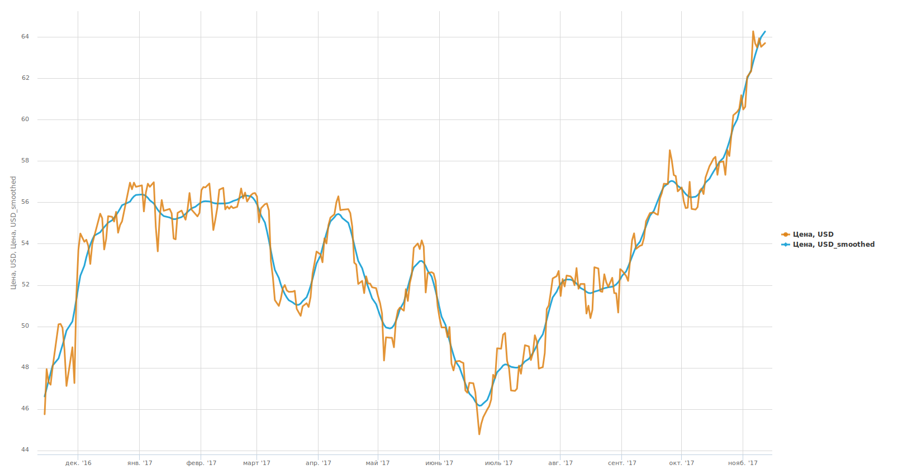

#  Сглаживание

## Описание

Обработчик предназначен для сглаживания численных рядов данных и выделения трендовой составляющей. Для этих целей в нем можно использовать фильтр Ходрика-Прескотта или один из трех типов вейвлетов - вейвлеты Добеши, Койфлеты и CDF 9/7. Имеется возможность сглаживания рядов с пропущенными данными, при этом фильтр Ходрика-Прескотта подставляет вместо пропусков значения, которые обеспечивают максимальную гладкость в смысле функционала фильтра, а в случае вейвлет-сглаживания пропуски предварительно интерполируются линейно.

%spoiler%Пример%spoiler%

На данной диаграмме оранжевым цветом изображен график, соответствующий исходному ряду данных (динамика цен на нефть марки Brent), а синим - исходный ряд, обработанный компонентом "Сглаживание" с помощью фильтра Ходрика-Прескотта с параметром LAMBDA, равным 100. 

%/spoiler%

## Порты

### Вход

*  Входной источник данных - таблица данных.

### Выход

*  Выходной набор данных - исходная таблица, к которой добавлены поля со сглаженными рядами, метки таких полей снабжены постфиксами **_smoothed**.

## Мастер настройки

Предоставляет список численных полей, содержащихся во входной таблице. Поля, ряды которых требуется сгладить, следует отметить флагами, после этого в столбце "метод обработки" для каждого выбранного поля можно задать метод сглаживания:

* Фильтр Ходрика-Прескотта - имеет два взаимосвязанных параметра, радиокнопки переключают на редактирование одного из них:
  * Lambda - основной коэффициент фильтра, с увеличением которого возрастает сглаживание ряда.
  * Период сглаживания
* Вейвлет-сглаживание - тип вейвлета определяется радиокнопкой: Добеши, Койфлеты, CDF 9/7. Настройки всех вейвлетов идентичны:
  * Порядок вейвлета - определяет гладкость восстановленного ряда данных: чем меньше значение параметра, тем сильнее будут выражены «выбросы», и, наоборот, при больших значения параметра «выбросы» будут сглажены. Для вейвлета Добеши этот параметр может принимать значения от 1 до 10, для койфлетов - от 1 до 5, вейвлетом CDF 9/7 этот параметр не используется.
  * Продолжение границ - метод устранения искажений на границах ряда при сглаживании:
    * Симметричное;
    * Антисимметричное;
    * Продолжение нулями;
    * Константное;
    * Периодическое;
    * Симметричное без крайней точки;
    * Антисимметричное без крайней точки.
  * Глубина разложения - определяет «масштаб» отсеиваемых деталей: чем больше эта величина, тем более «крупные» детали в исходных данных будут отброшены. Использование слишком больших значений глубины разложения может привести к потере полезной информации из-за слишком большой степени «огрубления» данных. Параметр может принимать значения от 1 до 10.
