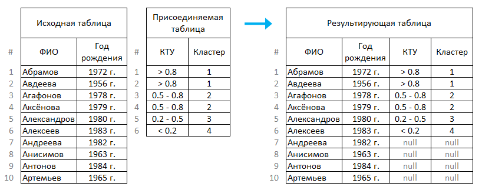

#  Соединение

С помощью обработчика *Соединение* исходный набор данных дополняется полями присоединяемых наборов. При этом каждая запись исходного набора соединяется с записью такого же порядкового номера дополнительного набора.

%spoiler%Пример:%spoiler%

  

%/spoiler%

Если соединяемые наборы данных имеют разное количество записей, то результирующий набор может содержать пустые значения. Мастер настройки предлагает различные варианты обработки данной ситуации. Соединяемые наборы могут обрезаться до количества записей меньшего набора или дополняться до наибольшего.

Так же к исходному набору можно присоединять переменные. Каждая из присоединяемых переменных добавляет новый столбец к исходному набору. При этом все строки нового столбца будут содержать одно и тоже значение — значение присоединенной переменной.

### Вход

*  **Главная таблица** — порт для входного набора данных.
*  **Добавить еще один порт** — создает новые порты входа для присоединяемых таблиц и переменных. Новые порты могут быть двух типов.
  *  Присоединяемая таблица [N], где N порядковый номер таблицы.
  *  Присоединяемые переменные [N], где N порядковый номер порта переменных.

### Выход

*  **Выходной набор данных** — таблица с присоединенными столбцами.

## Мастер настройки

Для настройки доступны следующие параметры:

* **Дополнение до наибольшего набора** — предлагается выбрать один из вариантов дополнения наименьших по количеству записей таблиц.
  * **Не дополнять** — дополнение записями, поля которых будут содержать пустые значения (NULL).
  * **Повторять набор** — таблицы дополнятся копиями своих же записей, начиная с первой.
  * **Дополнять последней строчкой** — дополнение копиями последней строки.
* **Количество строк соответствует** — предлагается выбрать один из вариантов определения количества записей результирующего набора данных. Количество записей определяется по.
  * Минимальному набору.
  * Максимальному набору.
  * Набором, выбранным в списке *Набор данных, определяющий набор строк*.
