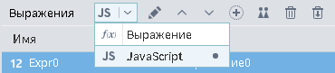

#  Калькулятор

## Описание

Создание новых полей, которые вычисляются по заданной формуле из значений переменных или используя JavaScript код.

### Вход

*  Входной источник данных (таблица данных);
*  Входные переменные (переменные), необязательный.

### Выход

*  Выходной набор данных (таблица данных).

## Мастер настройки

Окно настроек содержит области:

 1. [Список выражений](#spisok-vyrazheniy);
 2. [Область кода выражений](#oblast-koda-vyrazheniya);
 3. [Поля/переменные](#polyaperemennye);
 4. [Список функций](#spisok-funktsiy).

### Список выражений

Область предназначена для ввода **выражений** — вычисляемых полей, которыми в результате обработки будет дополнен входной набор данных. Значение выражения в каждой строке набора данных будет вычислено по формуле или JavaScript коду.

Новое выражение можно создать при помощи панели инструментов области или контекстного меню. Операции панели инструментов и контекстного меню:

*  **Редактировать** — задание параметров выражения;
*  **Переместить вверх** — поднять выражение на одну позицию вверх по списку;
*  **Переместить вниз** — опустить выражение на одну позицию вниз по списку;
*  **Добавить выражение** — добавляет новое выражение с параметрами по умолчанию;
*  **Добавить выражение по образцу** — добавляет новое выражение с типом данных, описанием и формулой, как у текущего выражения;
*  **Удалить выражение** — удаляет текущее выражение;
*  **Удалить все выражения** — удаляет все имеющиеся выражения.

При добавлении и редактировании выражения отображается диалог редактирования параметров. Следующие параметры выражений доступны для изменений:

* **Имя** —  в выходном наборе данных. Имя должно быть уникальным, начинаться с заглавной или строчной латинской буквы или с символа подчеркивания. Последующие символы имени могут быть такими же, либо цифрами.
* **Метка** —  в выходном наборе данных.
* **Тип данных** —  поля в выходном наборе данных.
* **Промежуточное** — при установке этого флага выражение может использоваться в расчетах, не включается в список полей выходного набора данных.
* **Кэшировать** — сохранение однажды вычисленного значения выражения, целесообразно при неоднократном использовании значений выражения последующими обработчиками и визуализаторами во избежание выполнения повторных вычислений.
* **Описание** — поясняющая информация.

При первом открытии мастера настройки список выражений содержит один элемент с именем "Expr0" вещественного типа. По умолчанию для нового выражения назначается метка ВыражениеN и имя ExprN, где N — номер, обеспечивающий уникальность.

### Область кода выражения

В области кода задается формула расчета выражения или JavaScript код. Ссылки на поля/переменные и синтаксические конструкции функций можно вставлять в код выражения, выбрав их двойным кликом мыши в соответствующих областях или перетащив мышкой.

Изменения в области кода сохраняются при выходе из нее.

### Поля/переменные

Область содержит список полей и переменных, передаваемых на вход обработчика. Перечень и параметры полей/переменных определяются при настройке входных портов обработчика.

Двойной клик мыши по позиции списка вводит имя поля/переменной в область кода выражения. То же самое можно сделать при помощи Drag-and-drop.

### Список функций

Наименование, входные аргументы и описание [доступных для использования функций](../../func/README.md).

Возможна фильтрация по категории и названию функции.

Двойной клик мыши по позиции выбранной функции вставляет ее синтаксис в область кода выражения. То же самое можно сделать при помощи Drag-and-drop.

Ссылки на поля/переменные и синтаксические конструкции функций можно вставлять в код выражения, выбрав их двойным кликом мыши в соответствующих областях или перетащив мышкой.

## Режим работы калькулятора

В Loginom существует два способа расчета выражений:

* [Выражение](./expression.md);
* [JavaScript](./javascript.md).

Для выбора режима в калькуляторе необходимо в выпадающем списке окна "Выражения" выбрать "JavaScript" или "Выражение" (см. рисунок 1).

----

**Примечание:** Режим работы калькулятора "Выражение" или "JavaScript" выбирается для всех полей, т.е. нельзя установить для одного поля режим "Выражение", а для другого "JavaScript".