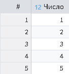
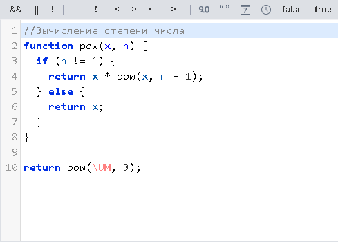
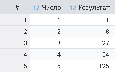

# Java Script

Рассмотрим использование JavaScript в калькуляторе на примере вычисления степени числа. На вход калькулятора поступает набор данных представленный на рисунке 1.



Функция для вычисления степени числа:

```javascript
//Вычисление степени числа
function pow(x, n) {
  if (n != 1) {
    return x * pow(x, n - 1);
  } else {
    return x;
  }
}
```

Для использования функции, написанной выше, необходимо ее вызвать с нужными аргументами и перед ней написать `return` для вывода результатов в новое поле:

```javascript
return pow(NUM, 3);
```

Где `NUM` — поле из входного набора данных.

>**Важно:** Скрипт необходимо завершать командой `return`, иначе скрипт будет выполнен, но на выходе обработчика никаких результатов не будет.

Общий скрипт в области кода выражения представлен на рисунке 2.



В результате получим выходной набор данных, представленный на рисунке 3.


