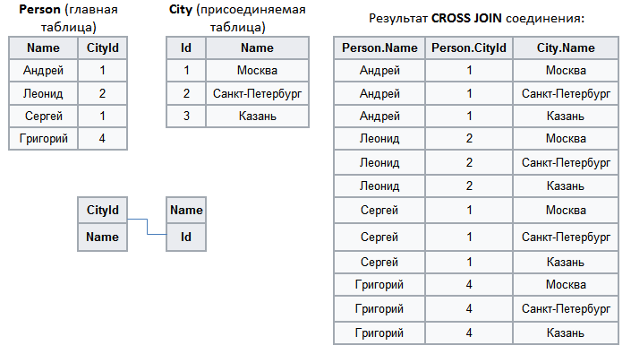
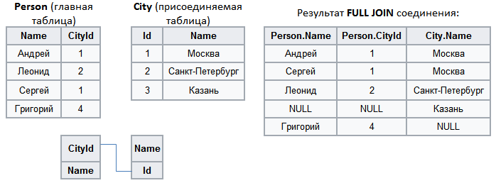

#  Полное соединение

Аналогом данного способа слияния являются SQL-операторы `CROSS JOIN` и `FULL JOIN`.

## CROSS JOIN

При `CROSS JOIN` соединении производится перекрестное соединение (или декартово произведение) — каждая строка одной таблицы соединяется с каждой строкой второй таблицы, давая тем самым в результате все возможные сочетания строк двух таблиц.
При таком соединении порядок таблиц (левая, правая) неважен, и отсутствует необходимость в сопоставлении ключевых полей.

%spoiler%Пример:%spoiler%

%/spoiler%

## FULL JOIN

При `FULL JOIN` соединении производится полное внешнее соединение двух наборов. В результирующий набор добавляются следующие записи:

 1. Внутреннее соединение (`INNER JOIN`) первой и второй таблиц;
 2. Записи первой таблицы, которые не вошли во внутреннее соединение на шаге 1. Для таких записей поля, соответствующие второй таблице, заполняются значениями `NULL`;
 3. Записи второй таблицы, которые не вошли во внутреннее соединение на шаге 1. Для таких записей поля, соответствующие первой таблице, заполняются значениями `NULL`.

При таком соединении необходимо сопоставление ключевых полей, но порядок таблиц (левая, правая) неважен.

%spoiler%Пример:%spoiler%

%/spoiler%

>**Важно:** Для того, чтобы при способе слияния *Полное соединение* использовать `FULL JOIN` соединение, необходимо в мастере настройки сопоставить ключевые поля соединяемых наборов. Если сопоставление отсутствует, то задействуется алгоритм `CROSS JOIN` соединения. При данном способе слияния объем результирующей выборки может очень быстро расти.
