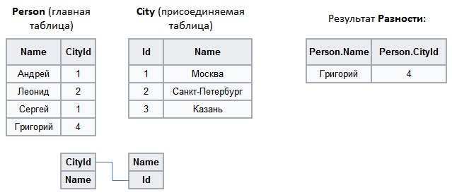

#  Разность

SQL-операторов аналогов данной операции нет. Результирующий набор данных содержит записи основного набора, для которых по ключевым полям не найдено соответствий в присоединяемом наборе. В результирующем наборе присутствуют поля только основного набора.

%spoiler%Пример:%spoiler%

%/spoiler%