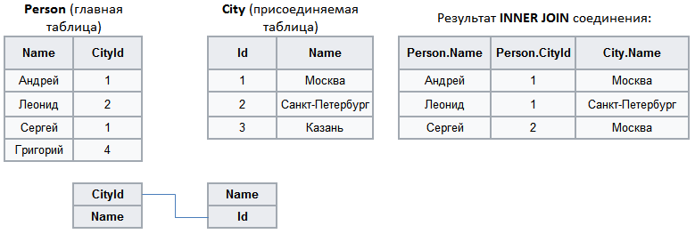

#  Внутреннее соединение

Аналогом такого соединения является SQL-оператор **INNER JOIN**.

При **INNER JOIN** происходит соединение двух таблиц. Для данного способа слияния порядок таблиц не важен.
Результирующий набор данных содержит все строки, для которых найдено совпадение ключевых полей главной и присоединяемой таблицы.

Пример:

