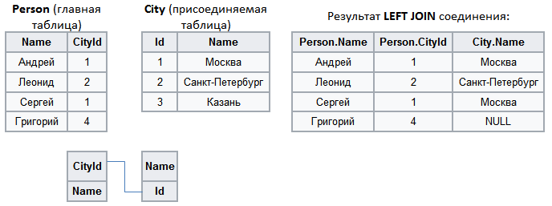

#  Левое соединение

Аналогом данного вида слияния является SQL-оператор **LEFT JOIN**. Левой таблицей является основной набор данных.

При **LEFT JOIN** производится соединении двух таблиц - главной (левая таблица) и присоединяемой (правая таблица). В результирующий набор добавляются следующие записи:

 1. внутреннее соединение (INNER JOIN) левой и правой таблиц по ключевым полям;
 2. затем в результат добавляются те записи левой таблицы, которые не вошли во внутреннее соединение на шаге 1. Для таких записей поля, соответствующие правой таблице, заполняются значениями NULL.

Пример:

