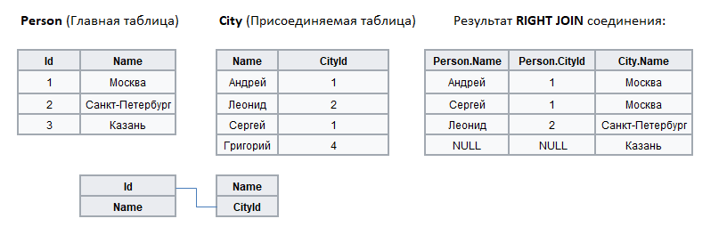

#  Правое соединение

Аналогом данного вида слияния является SQL-оператор **RIGHT JOIN**.

При **RIGHT JOIN** производится соединение двух таблиц - главной (левая таблица) и присоединяемой (правая таблица). В результирующий набор добавляются следующие записи:
 
 1. Внутреннее соединение (INNER JOIN) левой и правой таблиц по ключевым полям;
 2. Затем в результат добавляются те записи правой таблицы, которые не вошли во внутреннее соединение на предыдущем этапе. У таких записей поля, предназначенные для значений из левой таблицы, заполняются значениями NULL.

Пример (ключевыми полями являются Id и CityId):

