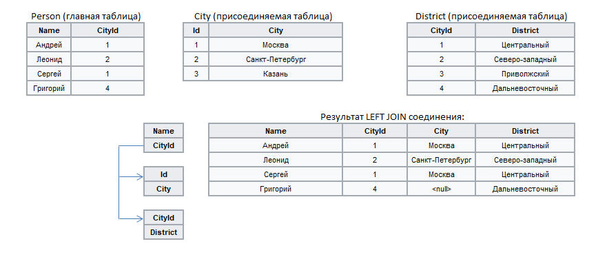

#  Дополнение данных

## Описание

Соединение таблиц данных на основе связи по ключевым полям - аналог операции LEFT JOIN в SQL. В качестве главной может быть использована только одна таблица, которая будет дополнена данными из присоединяемых таблиц, количество которых произвольно.

Пример

## Порты

### Вход

*  Главная таблица - в контексте понятий языка SQL-запросов является левой таблицей для соединения.

*  Присоединяемая таблица - в контексте понятий языка SQL-запросов является правой таблицей для соединения.

*  Добавить еще один порт - создает новые порты входа для последующих присоединяемых таблиц, которые будут автоматически пронумерованы.

### Выход

*  Выходной набор данных - таблица, содержащая поля всех таблиц, поданных на входные порты, кроме полей присоединяемых таблиц, выбранных в качестве ключевых. По желанию к меткам полей присоединяемых таблиц можно добавить префиксы.

## Мастер настройки

* **Область настройки ключевых полей** - напротив поля главной таблицы, которое должно стать ключевым, следует выставить флаг в столбце присоединяемой таблицы. Из выпадающего списка необходимо выбрать поле, по которому таблицы будут связываться. При включенной фильтрации  доступны совместимые поля, которые еще не связаны с ключевыми полями главной таблицы, при отключенной фильтрации  можно выбрать любое из полей, совместимых по типу.

* **Использовать префиксы** - включение данного флага позволяет добавить в результирующей таблице префиксы к именам и меткам полей, взятых из присоединяемых таблиц:
  * Префикс имени;
  * Префикс метки.

----

**Смотри также:**

* [Слияние](./join/README.md)

* [Соединение](./addition.md)

* [Объединение](./union.md)
