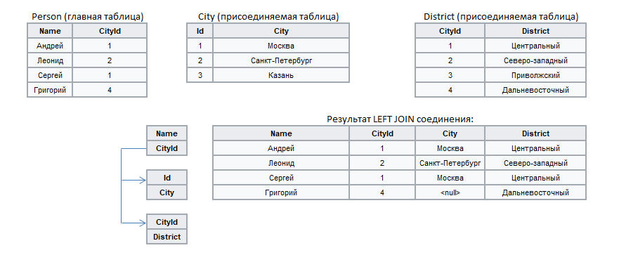

#  Дополнение данных

Соединение таблиц данных на основе связи по ключевым полям — аналог операции `LEFT JOIN` в SQL. В качестве главной может быть использована только одна таблица, которая будет дополнена данными из присоединяемых таблиц, количество которых произвольно.

%spoiler%Пример:%spoiler%

%/spoiler%

## Порты

### Вход

*  **Главная таблица** — в контексте понятий языка SQL-запросов является левой таблицей для соединения;
*  **Присоединяемая таблица** — в контексте понятий языка SQL-запросов является правой таблицей для соединения;
*  **Добавить еще один порт** — создает новые порты входа для последующих присоединяемых таблиц, которые будут автоматически пронумерованы.

### Выход

*  **Выходной набор данных** — таблица, содержащая поля всех таблиц, поданных на входные порты, кроме полей присоединяемых таблиц, выбранных в качестве ключевых. По желанию к меткам полей присоединяемых таблиц можно добавить префиксы.

## Мастер настройки

* **Область настройки ключевых полей** — напротив поля главной таблицы, которое должно стать ключевым, следует выставить флаг в столбце присоединяемой таблицы. Из выпадающего списка необходимо выбрать поле, по которому таблицы будут связываться. При включенной фильтрации  доступны совместимые поля, которые еще не связаны с ключевыми полями главной таблицы, при отключенной фильтрации  можно выбрать любое из полей, совместимых по типу.
* **Использовать префиксы** — включение данного флага позволяет добавить в результирующей таблице префиксы к именам и меткам полей, взятых из присоединяемых таблиц.
  * **Префикс имени** — в это поле вводится префикс добавляемый к имени присоединенных полей таблиц, состав именного префикса следует правилу [Параметров полей набора данных](../../data/datasetfieldoptions.md).
  * **Префикс метки** — в это поле вводится префикс добавляемый к метке присоединенных полей таблиц, именуется согласно *Параметрам полей набора данных*.