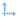
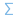

#  Разгруппировка

## Описание

Компонент исполняет процесс, по своей сути обратный процессу агрегации по сумме, применяемому в [группировке](../../processors/transformation/grouping.md). Для определения групп, по которым будет производиться обратная агрегация численного поля, требуется опорная таблица, из которой заимствуются сами группы и учитывается процентное распределение значений численного поля между ними.

Область основного применения разгруппировки - это детализация спрогнозированных данных на основе уже имеющихся. Например, если имеются данные о суммах совершенных продаж конкретных товаров, эти данные можно использовать для разгруппировки по товарам таблицы прогноза, сделанного только для товарных групп.

++++ Пример: |
Допустим, у нас есть прогноз сумм продаж, составленный для двух товарных групп, и нам нужно выявить из этого прогноза суммы продаж для отдельных товаров.

**Разгруппируемые данные:**

| Группа товаров | Сумма продаж, тыс. руб. |
| ----------- | ----------- |
| Товары для дачи | 42,00 |
| Товары для дома | 5,00 |

В качестве опорных данных будем использовать данные о суммах продаж за предыдущий период:

**Данные для расчета долей:**

| Группа товаров | Название товара | Сумма продаж, тыс. руб. |
| ----------- | ----------- | ----------- |
| Товары для дачи | Кресло плетеное | 16,00 |
| Товары для дачи | Лопата совковая | 23,50 |
| Товары для дома | Сахарница расписная | 5,70 |
| Товары для дома | Графин стеклянный | 4,20 |
| Товары для дачи | Термос стальной | 7,60 |
| Товары для дачи | Семена тюльпанов красных | 5,30 |
| Товары для дачи | Жидкость для розжига | 6,20 |
| Товары для дома | Розовая шипучка | 1,60 |
| Товары для дома | Мыло детское | 2,90 |

При настройке узла разгруппировки выберем метод **с расчетом долей по всей выборке**, выставим округление до одного знака после запятой и **пропорциональный** метод балансировки. В области настройки назначений полей свяжем поля "Группа товаров" обеих таблиц, полю "Сумма продаж" из разгруппируемой таблицы выставим назначение **Разгруппируемое**, а полям "Название товара" и "Сумма продаж" из опорной таблицы - назначения **Поле с наименованиями** и **Поле с долями** соответственно.

**Выход разгруппировки:**

 | Группа товаров | Название товара | Сумма продаж группы, тыс. руб. | Сумма продаж группы округленная, тыс. руб. | Разгруппированное значение |
 | ----------- | ----------- | ----------- | ----------- | ----------- |
 | Товары для дачи | Кресло плетеное | 42,00 | 42,00 | 11,50 |
 | Товары для дачи | Лопата совковая | 42,00 | 42,00 | 16,90 |
 | Товары для дачи | Термос стальной | 42,00 | 42,00 | 5,40 |
 | Товары для дачи | Семена тюльпанов красных | 42,00 | 42,00 | 3,8 |
 | Товары для дачи | Жидкость для розжига | 42,00 | 42,00 | 4,40 |
 | Товары для дома | Сахарница расписная | 5,00 | 5,00 | 1,90 |
 | Товары для дома | Графин стеклянный | 5,00 | 5,00 | 1,50 |
 | Товары для дома | Розовая шипучка | 5,00 | 5,00 | 0,60 |
 | Товары для дома | Мыло детское | 5,00 | 5,00 | 1,00 |

Сумма продаж группы, тыс. руб. - сумма продаж для конкретный группы;
Сумма продаж группы округленная, тыс. руб. - в этом поле выводятся значения, получаемые при применении округления;
Разгруппированное значение - в текущем примере это детализация продаж товаров, измеряемая в тыс. руб.

**Показатели качества модели и сезонные индексы:**
для выбранного в данном примере метода разгруппировки эта таблица не составляется.

++++

## Порты

### Вход

*  Разгруппируемые данные - таблица, содержащая поле для разгруппировки.

*  Данные для расчета долей - таблица, из которой считываются значения долей для разгруппировки.

### Выход

*  Выход разгруппировки - исходная таблица после обработки, в нее добавляются следующие поля:
 * *Метка поля*|Округлено - поле содержит округленные *разгруппируемые* значения (в случае применения округления);
 * Разгруппированное значение

* Если применяется метод "с учетом временных колебаний и сезонности опорных данных", то в эту таблицу добавляются также следующие поля:
 * Верхняя граница 95% ДИ - верхняя граница 95%-го доверительного интервала;
 * Нижняя граница 95% ДИ - нижняя граница 95%-го доверительного интервала;
 * Значение тренда - значение тренда в данной точке для данной позиции;
 * Значение сезонного индекса - коэффициент, характеризующий сезонность для данной точки и данной позиции;
 * Код типа значения - в зависимости от итогов разгруппировки, может принимать значение от 0 до 6;
 * Тип значения - содержит пояснения к каждому коду типа значения, где:
 * 0 - Нормально разгруппированное значение;
 * 1 - Разгруппированное значение, которое изначально было задано как фиксированное, но фиксация была снята алгоритмом;
 * 2 - Зафиксированное пользователем значение;
 * 3 - Значение, зафиксированное пользователем, но несогласованное с опорной выборкой;
 * 4 - Значение, зафиксированное алгоритмом в ходе расчетов;
 * 5 - Ошибочное значение;
 * 6 - Исключено из обработки.

*  Показатели качества модели и сезонные индексы - справочная таблица, составляется только при использовании метода "с учетом временных колебаний и сезонности опорных данных", содержит поля:
 * Индекс качества разгруппировки - принимает значения от 0 (очень плохое качество, результатам нельзя доверять) до 1 ("идеальное" качество, опорная выборка не содержит шума, а разгруппированные значения точно укладываются в прогноз);
 * Сезонный индекс (1, 2, 3,..) - количество полей с сезонными индексами указывается в мастере настройки.

## Мастер настройки

* Метод разгруппировки:
 * По заданным долям - метод применяется, когда доли для разгруппировки уже присутствуют в опорной таблице; в типичном случае сумма долей должна быть равна единице, но это условие не является обязательным;
 * С расчетом долей по всей выборке - процентное соотношение долей для разгруппировки будет таким же, как и у значений поля опорной таблицы, выбранного для расчета долей;
 * С учетом временных колебаний и сезонности опорных данных - применяется для разгруппировки временного ряда данных.

* Формат округления:
 * Не округлять;
 * Округлять до кратного целому - округление разгруппированных значений до чисел, кратных заданному целому числу;
 * Округлять до заданной точности - округление разгруппированных значений до указанного количества цифр после запятой.

* Метод балансировки - подсчитывается разница между округленным разгруппируемым значением и фактической суммой округленных разгруппированных. После этого разница распределяется между всеми разгруппированными значениями в соответствии с выбранным методом балансировки:
 * Нет балансировки - распределения разницы не производится;
 * Все последнему - прибавляется к последнему разгруппированному значению;
 * Пропорционально - разница распределяется частями, пропорциональными величине разгруппированных значений;
 * Равномерно - распределяется между разгруппированными значениями поровну.

* Область настройки назначений полей - представляет собой две таблицы, в первой находится перечень полей разгруппируемых данных, во второй - перечень полей данных для расчета долей. Возможные варианты назначения полей:
 *  Группа - такое назначение выставляется автоматически при связывании полей групп. Связывать следует поля групп, одинаковые для обеих таблиц - для этого достаточно перетащить метку поля из одной таблицы на соответствующую метку поля из другой таблицы; если образованная при этом связь ошибочна, удалить ее можно нажатием на расположенную на ней кнопку ;
 *  Разгруппируемое - назначение выставляется полю таблицы разгруппируемых данных, к которому и будет применена разгруппировка;
 *  Поле с наименованиями - выставляется полю опорной таблицы, содержащему наименования, по которым будет производиться разгруппировка;
 *  Поле с долями - выставляется полю опорной таблицы, содержащему доли или значения для расчета долей;
 *  Порядковое поле - данное назначение доступно только для полей типа "дата-время" при использовании метода "с учетом временных колебаний и сезонности опорных данных".

Настройка порядка следования данных - этот шаг мастера добавляется при использовании метода "с учетом временных колебаний и сезонности опорных данных", настройки следующие:

* Сезонность:
 * Период сезонности - выбор длины периода сезонности; если задать пункт "нет сезонности", откроются опции для настройки прогноза по числу точек временного ряда, а настройки по числу периодов заблокируются;
 * Количество рассчитываемых сезонных индексов - в таблицу выходного порта "Показатели качества модели и сезонные индексы" для каждого индекса будет добавлено поле;

* Разгруппируемый ряд:
 * Плотность точек редких товаров - коэффициент может принимать значения от 0,01 до 1; чем он выше, тем больше позиций будет распознано алгоритмом в качестве слишком редких и они будут исключены из прогноза;
 * Периодов отсутствия для прекращения позиции - если позиция отсутствует в ряду указанное число периодов, то она исключается из прогноза;
 * Точек отсутствия для прекращения позиции - если позиция отсутствует в ряду указанное число точек, то она исключается из прогноза;
 * Периодов присутствия для новой позиции - позиции, встречающиеся не чаще указанного числа периодов, будут считаться новыми;

* Глубина истории:
 * Максимальное число периодов сезонности - для построения прогноза будет использовано указанное число последних периодов опорных данных; если задать значение 0, будут использованы все периоды;
 * Максимальное число точек каждого ряда - для построения прогноза будет использовано указанное число последних точек ряда опорных данных; если задать значение 0, будут использованы все точки.
