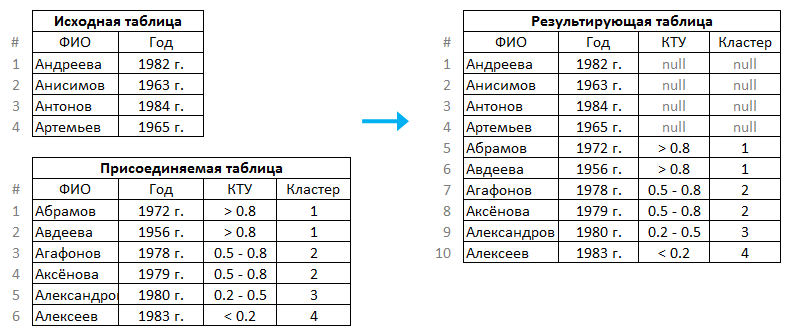

#  Объединение

## Описание

С помощью обработчика "Объединение" исходный набор данных дополняется записями присоединяемых наборов. "Объединение" является аналогом операции UNION в SQL.

%spoiler%Пример:%spoiler%

 

%/spoiler%

### Вход

*  **Главная таблица** (таблица данных);
*  **Присоединяемая таблица[N]** (таблица данных).

Количество присоединяемых таблиц задается пользователем путем добавления входных портов обработчика.

### Выход

*  **Выходной набор данных** (таблица данных).

## Мастер настройки

Полям главной таблицы необходимо сопоставить поля присоединяемой таблицы. В результирующем наборе данные сопоставленных полей объединяются в одно поле. Это поле получает "Имя" и "Метку" поля главной таблицы. Данные несопоставленных полей помещаются в отдельный столбец результирующего набора.

Сопоставление возможно только для полей с одинаковым типом данных. При первоначальном открытии мастера поля с одинаковым именем и типом данных сопоставляются автоматически. Ручная настройка осуществляется с помощью элементов управления:

*  — отмечаются поля присоединяемых таблиц, участвующие в сопоставлении;
* **Раскрывающиеся списки полей** — содержатся в каждой строке таблицы сопоставления. Список позволяет выбрать поле присоединяемой таблицы, которое будет сопоставлено полю главной таблицы;
* **Группа параметров "Использовать префиксы"** — применяется, если необходимо выделить несопоставленные столбцы присоединяемых таблиц. Для таких столбцов в результирующем наборе данных можно задать:
  * **Префикс имени**;
  * **Префикс метки**.
