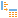

#  ДЕРЕВО В ТАБЛИЦУ

Обработчик преобразует данные, представленные в иерархической древовидной форме, в таблицу. Отмеченные узлы будут выведены в колонки выходного набора данных.

## Порты

## Вход

 **Входное дерево** — набор данных в иерархической древовидной форме.

## Выход

 **Выходной набор данных** — таблица данных.

## Мастер настройки

### Настройка входных узлов

На данном шаге настраивается соответсвие полей входного и выходного наборов данных.
В списке Входное дерево отображаются поля принятого портом набора данных, которые следует сопоставить с полями набора, подаваемого на выходной порт. Поля выходного набора представлены в списке Выходное дерево.

Для сопоставления полей необходимо задать между ними связи. Это можно сделать нажав кнопку **Связать автоматически**. Входные и выходные поля будут связаны, если у них совпадают имена и тип данных. 
Связи также можно установить вручную, с помощью метода *Drag-and-drop* путем перетаскивания элемента из левого списка на элемент из правого списка. В этом случае имена полей не важны, однако типы данных должны совпадать.

Связи между узлами можно удалять: 
* с помощью кнопки   **Удалить все связи** — удаляет все связи;
* нажатием на кнопку  на линии связи (при наведении курсора кнопка меняет вид на ).

Панель инструментов и контекстное меню списка Входное дерево содержит следующие команды:

*  **Выбрать все** — помечает все узлы.
*  **Снять выделение со всех** — снимает выделение со всех узлов.
*  **Инвертировать выделение** — возвращает узлы в предыдущее состояние.

Для списка Выходное дереево на панели инструментов и в контекстном меню доступны команды:

*  **Добавить дочерний узел** — позволяет добавить к корневому узлу дочерний узел;
*  **Добавить соседний узел** — позволяет создать узел того же уровня иерархии, что и выбранный;
*  **Редактировать...** — позволяет вызвать окно редактирования и изменить значения полей для выбранного узла (команду также можно вызвать горячей клавишей *F2*);
*  **Переместить вверх**  и   **Переместить вниз** — позволяют менять порядок узлов, при этом корневой узел **Root** переместить нельзя (команды также доступны по комбинации горячих клавиш *Ctrl+Up* и *Ctrl+Down* соответственно);
*  **Синхронизировать поля** — синхронизируется список выходных полей порта со списком входных (алгоритм синхронизации см. [автоматическая синхронизация полей](./field-synchronization.md));
*  **Автоматическая синхронизация** — при включении данного режима команда   Синхронизировать поля будет выполняться автоматически при выполнении узла (включена по умолчанию).
*  **Удалить** — удаляет дочерний узел дерева, иконка этой команды высвечивается при наведении курсора на узел (команду также можно вызвать горячей клавишей *Delete*);
* **Удалить все...** — удаляет все дочерние узлы (комбинация горячих клавиш *Shift+Delete*).
> **Примечание:** Удалить корневой узел **Root** нельзя.

Записи в списках Входное дерево и Выходное дерево можно отфильтровать с помощью команды **Фильтрация** на соответствующей панели инструментов.

### Выбор узлов дерева

Мастер настройки представляет собой отображение дерева с возможностью выбора некоторых или всех узлов дерева. Отмеченные узлы будут выведены в колонки выходного набора данных.

Доступные действия представлены в виде кнопок на панели инструментов и в меню таблицы с отображением дерева данных:

*  **Выбрать все** – помечает все узлы.
*  **Снять выделение со всех** – снимает выделение со всех узлов.
*  **Инвертировать выделение** – возвращает узлы в предыдущее состояние.

Логика выбора узлов:

* При выборе узла выбираются так же и его родители, вплоть до корня.
* При снятии выделения с ветки выделение снимается и со всех потомков.
* Глобальный индекс узла - узел отсутствует в древовидной структуре данных, однако он появляется в отображении дерева и указывает на индекс, используемый в узле-массиве. Его можно выбрать, при этом также выбирается и узел массива.
Узел получает индекс -1, который учитывается при сортировке.
При выборе узла для него формируется колонка с именем узла массива с добавлением  "_global_index" и меткой узла массива с добавлением "|Глобальный индекс".

> **Важно:** Компонент будет выдавать ошибку при выходе со страницы настройки или при выполнении, если у него нет ни одного выбранного узла.

**Дублировать значения родительских узлов** – если в структуре имеется родительский узел и последовательность потомков, значение родительского узла будет продублировано для каждой строки, образованной из последовательности потомков.

**Генерировать составные метки полей** – при наличии данного флага используется составная метка узла массива: в метках полей будет отражена иерархия относительно корневого элемента.
