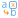

#  Замена (переменные)

## Описание

Обработчик заменяет входные переменные, используя таблицы замен. Таблицы замен содержат пары заменяемых и новых значений или вычисляющие их регулярные выражения.

Последовательность действий алгоритма замены:

 1. В первую очередь производится поиск и замена по [точному совпадению](../transformation/substitution/exact-match.md) со значениями, указанными в таблице замен.
 2. Среди значений, не найденных по точному совпадению, производится поиск по [регулярным выражениям](../transformation/substitution/regexp-match.md). Такие выражения могут быть заданы в таблицах замен. Новые значения также вычисляются регулярными выражениями.
 3. Выполняются правила замены для значений, не найденных на предыдущих шагах.

## Порты

### Вход

*  Входные переменные - переменные, подлежащие изменению.

### Выход

*  Выходные переменные - переменные после обработки.

## Мастер настройки

Окно мастера настройки состоит из трех областей.

### Список замен

Отображает входные переменные и способ замены для каждой переменной:

* **не заменять** - замены производиться не будут;

* **ввод вручную** - использовать таблицу замен.

### Таблица замен

Область отображает таблицу замен для выбранной переменной.

Для ввода новой строки в таблице замены используется кнопка . Таблица может содержать строки для поиска и замены по:

* **точному совпадению**;

* **регулярному выражению**.

При вводе таблицы замены доступен ряд действий через панель инструментов области:

*  **импорт** – вставка таблицы замен из [текстового файла заданного формата](../transformation/substitution/import-tz.md); если текстовый файл будет впоследствии изменен, на таблицу замен в узле компонента это не повлияет, и при необходимости обновления таблицы замен вставку из текстового файла следует повторить вручную;

*  **экспорт** - экспорт таблицы замен в текстовый файл;

*  **сортировка** - сортировка таблицы по полю исходного значения;

* **изменить тип замены** - изменить [тип данных](../../data/datatype.md) значения замены; заменяемое значение может отличаться от исходного, например, вещественную переменную можно заменить целочисленной или строковой;

*  **редактировать текущую замену** - отображает область редактирования текущей строки таблицы подстановок.

**Важно:**

 1. Замена по точному совпадению имеет приоритет перед заменой по регулярному выражению.
 2. При попытке замены значения вещественной переменной с изменением ее типа на целочисленный (опция "Изменить тип замены"), если условие замены не будет удовлетворено, то тип переменной все равно будет изменен на целочисленный.

### Дополнительные параметры

* **Заменять остальные** - содержит варианты замены значений, не найденных при помощи таблицы замен:
  * *не заменять* - замены производиться не будут;
  * *на пропущенное* - значения будут заменены на "NULL";
  * *на значение* - значения будут заменены на указанное;
  * *на регулярное выражение* - новое значение будет вычислено с использованием [синтаксиса регулярного выражения](../../processors/transformation/substitution/syntax-regexp.md).
* **Точность** - для полей целого и вещественного типов задает допустимый интервал от указанных в таблицах замен значений, при котором исходное значение будет заменено. [Применение допустимого интервала](../../processors/transformation/substitution/exact-match.md).
* **Регистрозависимые строки** - флаг устанавливает регистрозависимый режим поиска значений в таблицах замен. По умолчанию данный режим отключен.
