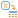

#  Переменные в таблицу

## Описание

Обработчик преобразовывает список переменных в таблицу. Значения переменных можно расположить в строках, либо в столбцах результирующей таблицы.

%accordion%Пример:%accordion%

Имеется список переменных:

* a = 5
* b = 7
* c = 10
* d = 2

Результат преобразования списка переменных:

* В столбцы

| a(сумма) | b(сумма) | c(сумма) | d(сумма) |
| ---------- | ---------- | ---------- | ---------- |
| 5 | 7 | 10 | 2 |

* В строки

| Имя | Метка | Значение |
| ---------- | ---------- | ---------- |
| a | a(сумма) | 5 |
| b | b(сумма) | 7 |
| c | c(сумма) | 10 |
| d | d(сумма) | 2 |

%/accordion%

### Вход

*  Входные переменные.

### Выход

*  Выходной набор данных (таблица данных).

## Мастер настройки

В окне мастера настройки предоставляется два варианта записи переменных:

* в столбцы - каждой переменной будет соответствовать отдельное поле таблицы;

* в строки - каждой переменной будет соответствовать отдельная запись.
