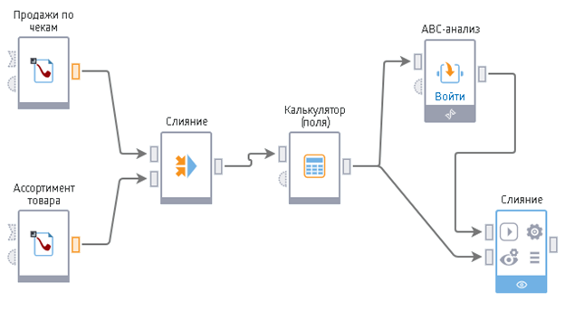
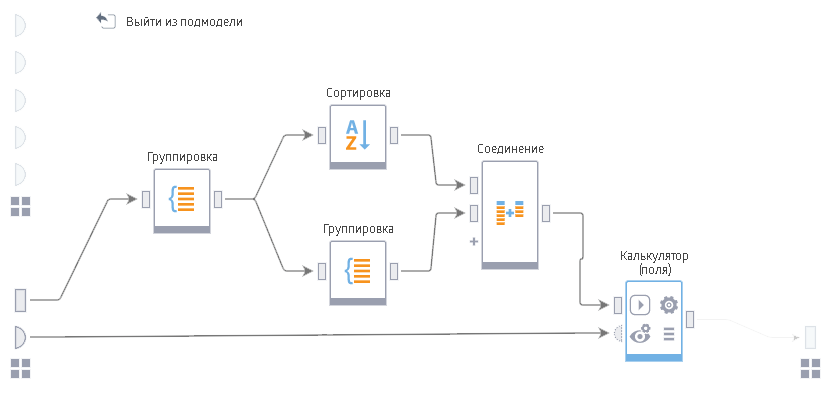

# Начало работы

**Loginom** - это аналитическая платформа, основа для создания законченных прикладных решений в области анализа данных. Реализованные в Loginom технологии позволяют на базе единой архитектуры пройти все этапы построения аналитической системы: от консолидации данных до построения моделей и визуализации полученных результатов.

Для решения задач анализа Loginom позволяет импортировать данные из различных источников и применять к ним необходимые алгоритмы обработки. Результаты можно просмотреть в самой системе или экспортировать в сторонние приемники данных. Таким образом, Loginom может использоваться как для создания автономных аналитических решений, так и для разработки модулей, интегрируемых со сторонними системами.

Одной из основных концепций, на которых базируется Loginom является Сценарий. **Сценарий** - последовательность действий, которые необходимо провести для анализа данных. Он представляет собой комбинацию узлов обработки данных, настраиваемую пользователем для решения конкретной задачи.

**Узел** сценария выполняет отдельную операцию над данными. Перечень возможных операций представлен палитрой готовых **компонентов**.

Последовательность обработки задается соединением выхода предыдущего узла сценария со входом последующего. Входом и выходом обработчика являются **входные** и **выходные порты**.

Узлы сценария создаются из компонентов 2-х типов:

* **Стандартные компоненты** — предоставляются в рамках платформы;
* **Производные компоненты** — создаются и настраиваются пользователем.

Производный компонент можно создать из комбинации узлов сценария, реализующих произвольную логику обработки.

Таким образом набор средств для реализации различной логики обработки данных не ограничивается стандартными компонентами платформы и может быть расширен самим пользователем.

Чаще всего для создания производного компонента используется [Подмодель](../processors/control/submodel.md). Подмодель является специальным узлом, способным включать в себя другие узлы сценария. Реализованная в Подмодели логика может быть произвольной, при этом разработчик сценария может рассматривать её как "черный ящик". Подмодель принимает информацию через входные
 порты, производит обработку и выдает результат на выходные порты. Входные и выходные порты задаются пользователем.

На рисунке "Пример Сценария" узел ["ABC-анализ"](https://wiki.loginom.ru/articles/abc-analysis.html) является производным компонентом - подмоделью.

В состав подмодели могут также включаться и другие подмодели. Вложенность подмоделей друг в друга не ограничена.

В Loginom существуют следующие виды портов:

| Порт | Описание |
|:---------|:---------|
| Таблица | Представляет собой структурированный набор данных, где все данные упорядочены в двумерную структуру, состоящую из столбцов и строк. В ячейках такой таблицы содержатся элементы данных: строки, числа, даты, логические значения. |
| Переменные | Представляют собой объекты, содержащие только одно значение. С помощью специальных обработчиков имеется возможность преобразовать данные из таблиц в переменные и обратно |
| Подключения | Определяют настройки для работы с внешними источниками и приемниками данных. Например, подключение к базе данных может содержать адрес базы, имя пользователя и прочую информацию, необходимую для корректной работы |

Поскольку таблицы, переменные и подключения имеют разную структуру, то соответствующие им порты не могут быть соединены друг с другом и имеют разное обозначение.

Количество входов и выходов узла варьируется в зависимости от функционала. Входы узла могут настраиваться автоматически (при подключении связи), либо вручную.
