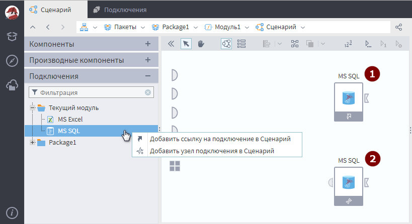
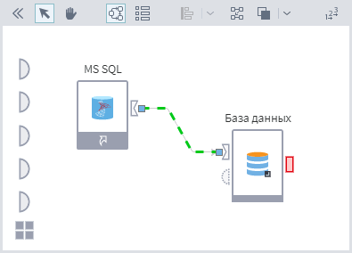

# Интеграция с базами данных

Для возможности работать в программе  с данными из какой-либо Базы данных предварительно необходимо, выполнить несколько подготовительных действий.

## Шаг 1. Создание подключения

Для работы с базой данных, предварительно необходимо создать подключение соответствующего типа, в зависимости от того к какой базе нужно подключиться.
Подробнее [о создании и настройке  подключения](../integration/connections/README.md).

## Шаг 2. Создание узла подключения в сценарии

Созданное подключение необходимо поместить в сценарий,  для этого необходимо создать узел, выходными данными которого будут являться параметры подключения к источнику данных.

Для создания узла:

1. Открыть сценарий для редактирования и развернуть панель Подключения, в которой содержится перечень всех созданных в пакете подключений.
2. Выделить необходимое подключение в панели и, вызвав кликом правой кнопки мыши его контекстное меню, воспользоваться одним из предложенных способов (см. рисунок 3):
   *  Добавить ссылку на Подключение в Сценарий — в сценарий будет добавлен [Узел-ссылка](../processors/control/unit-link.md) (1) на подключение. Также создать узел-ссылку можно, перетащив мышью выбранное подключение в область построения сценария.
   *  Добавить узел Подключения в Сценарий — в сценарий будет добавлен производный узел (2), унаследованный от выбранного подключения. Производный узел будет иметь те же настройки, что и выбранное подключение, однако, их возможно переопределить в мастере настройки узла (при этом настройки подключения, от которого был унаследован узел, не изменятся).

Параметры подключения к источнику данных используются узлами импорта/экспорта данных. Для этого выходные данные порта  узла подключения необходимо подать на входной порт  нуждающегося в этом подключении узла импорта/экспорта (см. рисунок 4).

## Шаг 3. Настройка узла импорта

Для получения информации из базы данных используется отдельный обработчик "[Импорт из базы данных](../integration/import/database.md)". Он позволяет импортировать таблицу БД или результаты выполнения SQL-запроса, заданного пользователем, а также представление - view.
