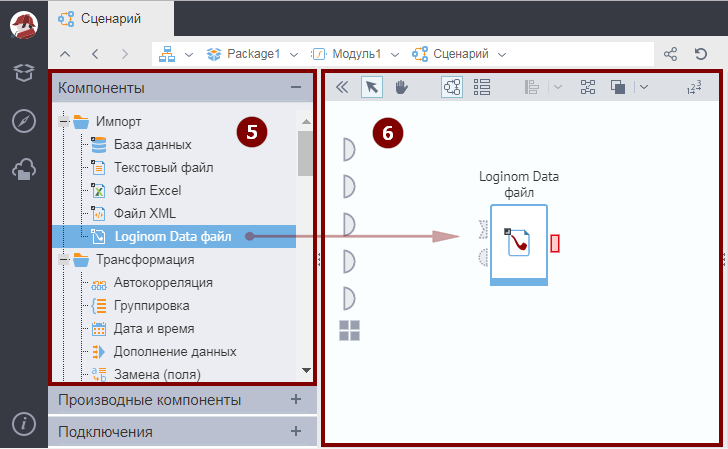
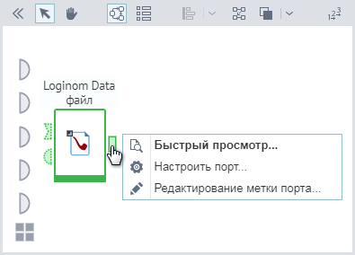
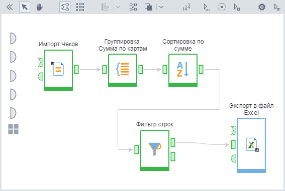
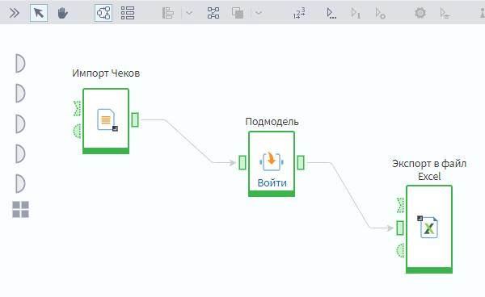

# Первый сценарий

В вариантах поставки **Enterprise**, **Standard** и **Team** при запуске программы открывается стартовая страница с авторизацией. Необходимо войти в систему, введя свой логин и пароль. Логин и пароль выдаются администратором, но при установке программы существует пользователь по-умолчанию - логин: user, без пароля. В варианте **Personal** авторизация отсутствует.

После авторизации открывается окно выбора действий (домашняя страница), в котором можно выполнять следующие операции с пакетами.

* *Создать пакет* - создание нового пакета, программа сразу попросить указать путь, куда сохранить пакет.
* *Создать временный пакет* - создание нового пакета без предварительного сохранения. Сохранить пакет можно будет уже во время работы с ним.
* *Открыть пакет*  - открытие ранее созданного пакета.

**Важно:** программа не поддерживает автосохранений, при закрытии окна программы (вкладки браузера) все изменения будут утеряны.

После выбора пакета пользователь попадает в рабочее пространство программы. Его можно разделить на четыре основных области (см. рисунок 1):

1. Слева расположено боковое выдвижное меню с кнопками: Меню, Пакеты, Навигация, Файлы, Процессы.
2. Верхняя часть отображает вкладки открытых пакетов, содержит адресную строку и элементы для навигации по пакетам и их составляющим.
3. Справа от выдвижного меню располагается рабочий стол. Он включает левое меню, где отображаются рабочие компоненты и структура решения (пакеты и их составные части), а также непосредственно область построения сценария и визуализации данных.
4. В нижней части окна расположена панель "Процессы". По умолчанию она скрыта, но ее можно закрепить.

*Рисунок 1. Рабочее пространство Loginom 6.0*

После создания пакета пользователь увидит Область построения сценария (6) и Панель "Компоненты" (5), содержащую стандартные компоненты, предоставляемые платформой (см. рисунок 2).

*Рисунок 2. Область построения сценария и Панель "Компоненты"*

В простейшем случае сценарий импортирует данные из внешних источников, преобразовывает их и экспортирует (либо выводит в отчет).
Создадим простой сценарий, формирующий ТОП10 лучших клиентов.

Сценарий выполнит действия:

* импорт из файла [Sales.txt](./Sales.txt) информации о продажах;
* выделение 10 клиентов с наибольшими суммами покупок;
* экспорт полученных результатов.

Для того, чтобы использовать в сценарии какой-либо компонент, его необходимо перенести мышью из панели компонентов в область построения сценария. Выберем в разделе "Импорт" компонент "Текстовый файл" и перенесем его в область построения (см. рисунок 2). При этом создастся узел сценария, выполняющий действия импорта. При клике мышкой на узле отобразятся иконки возможных действий. Вызовем [мастер настройки](../integration/import/ldf.md) (см. рисунок 3).

*Рисунок 3. Вызов мастера настройки узла*

Пройдем шаги мастера, указав в параметре "Имя файла" местоположение файла Sales.txt.

После настройки узла выполним его, используя меню возможных действий. Теперь в выходном порте узла присутствуют импортированные данные, которые можно увидеть выбрав "Быстрый просмотр" в контекстном меню порта (см. рисунок 4).

*Рисунок 4. Вызов быстрого просмотра*

Следующим шагом в алгоритме необходимо подсчитать общие суммы покупок по всем клиентам. Для этого переместим компонент "Группировка" в рабочую область сценария. Последовательность обработки данных задается соединением выходного порта узла импорта с входным портом группировки (см. рисунок 5).

*Рисунок 5. Формирование связи*

В [мастере настройки](../processors/transformation/grouping.md) узла группировки поле "Карта клиента" задается как группа, а "Сумма" как показатель. После настройки и выполнения узла группировки в выходном порту содержатся данные об итоговых суммах покупок клиентов.

Далее эти данные сортируются по убыванию суммы при помощи [компонента "Сортировка"](../processors/transformation/sorting.md) и затем передаются на узел выделения первых 10 строк таблицы.  Для этого используется компонент "Фильтр строк", в мастере которого задается условие: "№ Номер строки <= 10".

В результирующем сценарии добавляется узел экспорта и/или настраивается [визуализатор](../visualization/readme.md) результатов (см. рисунок 6).

*Рисунок 6. Результирующий сценарий*

Блок узлов, выполняющих формирование ТОП 10 клиентов возможно сгруппировать в отдельную функцию, поместив их в [Подмодель](../processors/control/submodel.md). Для этого необходимо выделить эти узлы и при помощи кнопки .

*Рисунок 7. Выделение блока узлов*

*Рисунок 8. Преобразование блока узлов в подмодель*

В дальнейшем подмодель, выполняющая заданную пользователем функцию, может быть опубликована как производный компонент и наравне со стандартными компонентами многократно использоваться в других сценариях. Принципы создания решений на основе собственных компонентов рассматривается в статье ["Проектирование сценариев"](../quick-start/scenario-construction.md).

Перед закрытием пакета его необходимо **сохранить**. Это можно сделать в меню "Пакеты" (см. рисунок 9).

*Рисунок 9. Сохранение пакета*

**Внимание**: в программе нет функции автосохранения!