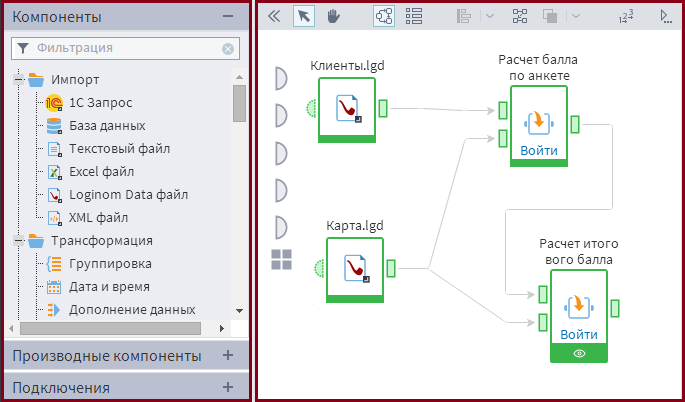

# Интерактивный режим работы

Интерактивный режим работы — режим, при котором проектирование, запуск узлов и отладка сценариев осуществляется в интерфейсе Loginom. 

Интерактивный режим работы осуществляется в рабочем пространстве платформы (см. Рисунок 1).

Разработка сценария ведется в специальной зоне — области построения сценария, которая расположена по центру.   
В Loginom узлы основываются на компонентах, панель которых расположена в левой части программного окна.  
Чтобы компонент стал узлом его необходимо перенести на рабочее пространство, как показано на рисунке.  

Расположив несколько узлов на рабочем пространстве и соединив их между собой, получится сценарий, запустить который можно с помощью последовательной (каждый узел отдельно) или одновременной активации узлов.
   
Корректировка сценария осуществляется путем стандартных манипуляций с узлами (настройки, добавления, удаления), а также воздействиями на их последовательные связи.