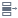

# Настройка порта: Интерфейс «Связи»

В списке "Входные" отображаются поля/переменные принятого портом набора данных (входного набора порта), которые следует сопоставить с полями/переменными выходного набора порта, представленными в списке "Выходные". Для связывания необходимо зажать левой кнопкой мыши ячейку поля из левого списка и перенести ее на ячейку поля из правого списка, с которым следует соотнести, затем отпустить левую кнопку мыши, при этом отобразится графическая связь между ними. Удалить такую связь можно нажатием на кнопку  на линии связи.

--------

**Важно:** Допустимо сопоставление полей/переменных только [совместимых типов данных](../../app/glossary/port/compatibility_datatypes.md).

-------

В случае, если настраивается входной порт принимающий табличные данные, список "Выходные" отображает назначение полей набора данных, подаваемого на обработку алгоритмом узла. Если настраивается входной порт принимающий переменные, список "Выходные" отображает значения переменных.

Панель инструментов списка "Входные" содержит следующие команды:

*   **Получить список** - загрузка списка входных полей в случае его отсутствия (например, если импорт из базы данных задается через SQL-запрос);

*   **Создать входной...** - создает для выбранного входного поля/переменной такое же поле в списке "Выходные" и устанавливает с ним соответствие;

*   **Создать выходные для всех входных...** - создает для всех входных полей/переменных такие же поля в списке "Выходные" и устанавливает с ними соответствие.

*  "Тип создания производных столбцов" - кнопка отображается в случае, когда алгоритм компонента предусматривает добавление в результирующий набор новых полей/переменных, вычисленных на основе исходных, варианты настройки следующие: 
    *  По умолчанию - индивидуален для каждого компонента, реализует либо режим "Замена", либо "Добавление";
    *  Добавление - к настраиваемым столбцам добавляются поля, вычисленные на основе обрабатываемых полей;
    *  Замена - вычисленные поля замещают обрабатываемые.

Панель инструментов списка "Выходные" содержит следующие команды:

*   **Добавить** - добавляет новое поле в список настраиваемых столбцов и открывает диалог редактирования его параметров;

*   **Настроить** - открывает диалог редактирования [параметров поля](../../app/glossary/datasetfieldoptions.md), диалог также можно открыть двойным кликом по выбранному полю;

*    **Переместить вверх/вниз** - изменяет позицию выделенного поля в списке (поля в исходящей с порта таблице будут расположены слева направо в том же порядке, в каком они расположены в списке сверху вниз);

*   **Синхронизировать поля** - синхронизируется список выходных полей/переменных порта со списком входных (алгоритм синхронизации см. [Автоматическая синхронизация полей](../../app/glossary/port/field_synchronization.md));

*   **Автоматическая синхронизация** - при включении данного режима команда   **Синхронизировать поля** будет выполняться автоматически при выполнении узла;

*   **Удалить все...** - список "Выходные" очищается;

*   **Удалить** - удаляет выделенную позицию в списке "Выходные", иконка этой команды высвечивается при наведении курсора на эту позицию.

Описание дополнительных команд мастера:

*   **Связать автоматически** - предпринимается попытка установить связи между выходным и входным списком полей/переменных. Список входных/выходных полей/переменных не изменяется (новые поля не добавляются). Могут быть добавлены новые связи. Если какие-то связи уже есть, то они остаются без изменения. Алгоритм создания связей пытается связать выходные поля/переменные, у которых нет связи, с входными, у которых нет связи:
    * сначала по признаку: "[совместим Тип данных](../../app/glossary/port/compatibility_datatypes.md) и совпадает Имя (без учета регистра)";
    * затем по признаку: "[совместим Тип данных](../../app/glossary/port/compatibility_datatypes.md) и совпадает Метка (без учета регистра)".

*   **Удалить все связи** - удаляет все имеющиеся связи;

*   **Упорядочить связи** - пересортировывает поля списков для устранения пересечений связей друг с другом;

*   **Отображать потерянные связи** - отображаются отсутствующие поля входного набора порта, с которыми ранее были настроены связи с существующими полями выходного набора. Такая ситуация может возникнуть при изменении структуры входных данных.

При необходимости настроить несколько позиций одновременно, их можно выделить следующими способами:

*  Зажать клавишу CTRL и выделить их по одному кликами левой кнопки мыши; повторное нажатие по полю снимает выделение;

*  Cделать клик по одному полю, зажать клавишу SHIFT, затем клик по другому полю - в результате будет выделен список позиций между этими полями.
Оба способа можно применять последовательно: например, сначала выбрать список через SHIFT, а потом зажать CTRL и убрать некоторые поля из списка или выделить другие.

