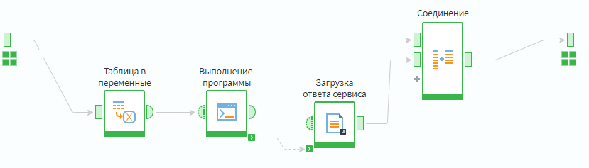
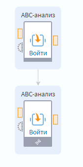
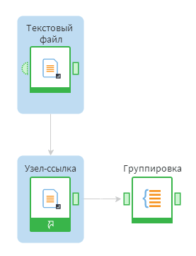

# Служебные порты

## Порт порядка выполнения

Порт порядка выполнения  предназначен для ручного определения последовательности выполнения узлов сценария. По умолчанию порт скрыт, для того чтобы отобразить его, необходимо воспользоваться кнопкой  панели инструментов области построения сценариев.

Для создания последовательности выполнения узлов следует соединить между собой порты задания порядка выполнения

(см. рисунок 1).

**Рисунок 1. Пример использования порта порядка выполнения**

## Порт связи наследования

Порт связи наследования (см. рисунок 2) предназначен для того, чтобы отобразить базовый узел производного компонента. Включить отображение родительского узла можно кнопкой  панели инструментов области построения сценариев.

-----

**Примечание:** Нахождение базового узла возможно только в том случае, если он расположен в пределах текущей области построения сценария.

-----

**Рисунок 2. Пример использования порта связи наследования**

## Порт связи ссылки

Порт связи ссылки (см. рисунок 3) позволяет отобразить исходный узел для Узла-ссылки. Включить отображение исходных узлов можно с помощью кнопки  панели инструментов области построения сценариев.

**Рисунок 3. Пример использования порта связи ссылки**