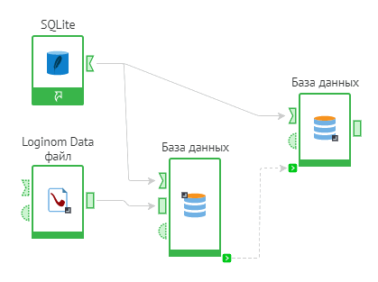
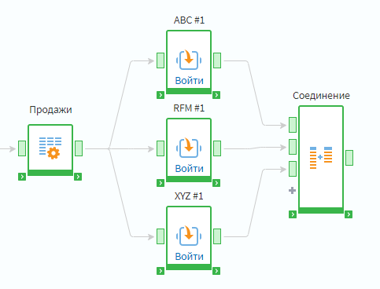
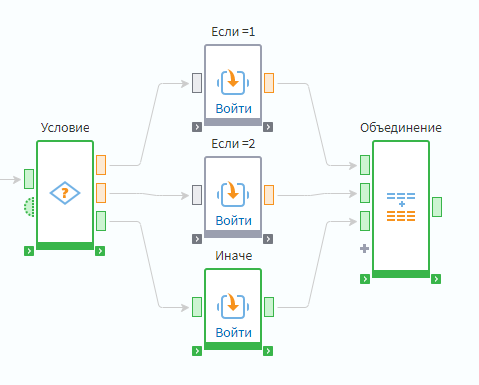
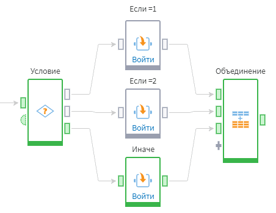

# Управление ходом выполнения сценария

## Последовательность выполнения

В общем случае последовательность выполнения узлов задается соединением их входных и выходных портов. Однако, иногда необходимая последовательность обработки данных не может быть задана таким образом. Например, если необходимо выгрузить данные во внешний источник и следующим действием загрузить уже модифицированные данные из внешнего источника. В этом случае для задания применяют [Служебные порты](./ports/service-ports.md)
(см. рисунок 1).

Loginom предоставляет возможность параллельного выполнения нескольких ветвей сценария. Например, следующие цепочки узлов будут выполнены параллельно (см. рисунок 2):

Подобная возможность позволяет сократить время выполнения сценария за счет более полного использования вычислительных мощностей компьютера.

## Настройка последовательности выполнения узлов

Иногда необходимо вручную задать последовательность выполнения узлов в сценарии. Для этого используются .

Для задания последовательности выполнения сценария используют порты синхронизации (см. рисунок 3):

В данном примере между узлами "Выполнение программы" и "Загрузка ответа сервиса" нет связи между входными и выходными портами. Чтобы последовательность выполнения этих узлов не прерывалась используется связь между служебными портами синхронизации.

Для отображения этих портов необходимо воспользоваться кнопкой  панели инструментов области построения сценариев.

### Цикл

[Цикл](../processors/control/cycle.md) — управляющая конструкция, предназначенная для организации многократного исполнения набора инструкций.

Loginom предоставляет возможность использования следующих разновидностей циклов:

* Цикл со счётчиком — аналог "FOR … TO …";
* Цикл с постусловием — аналог "DO … WHILE …";
* Цикл по набору данных (групповая обработка) — аналог "FOR EACH".

Использование Подмоделей позволяет легко реализовать *вложенность циклов*.

Имеется возможность выполнения циклов *в несколько потоков*, что может существенно сократить время обработки.

### Условие (ветвление)

[Условие](../processors/control/condition.md) — управляющая конструкция, обеспечивающая ветвление алгоритма в зависимости от значения некоторого выражения (аналог "SWITCH... CASE..."). В зависимости от заданного условия ход выполнения сценария может пойти по одной из возможных веток (см. рисунок 3).

