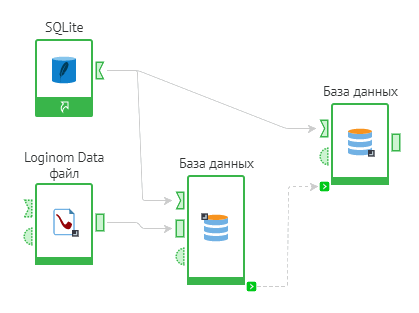
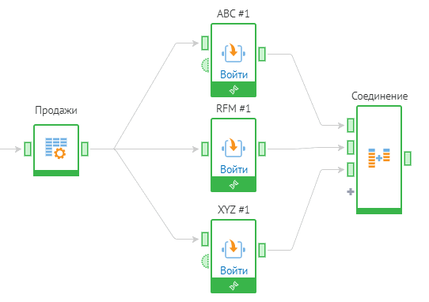
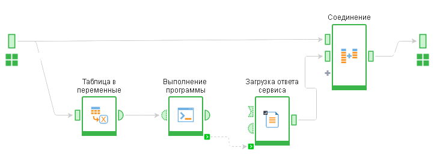
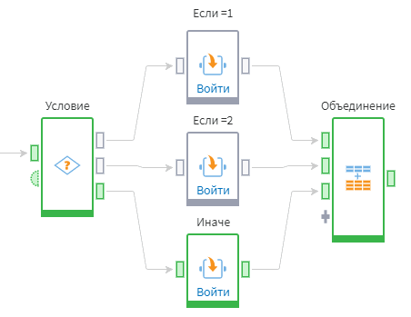

# Управление ходом выполнения сценария

## Последовательность выполнения

В общем случае последовательность выполнения узлов задается соединением их входных и выходных портов. Однако, иногда необходимая последовательность обработки данных не может быть задана таким образом. Например, если необходимо выгрузить данные во внешний источник и следующим действием загрузить уже модифицированные данные из внешнего источника. В этом случае для задания последовательности [применяют служебные порты]() (см. рисунок 1).

*Рисунок 1. Использование служебных портов для задания последовательности выполнения узлов*

Loginom предоставляет возможность параллельного выполнения нескольких ветвей сценария. Например, следующие цепочки узлов будут выполнены параллельно (см. рисунок 2):

*Рисунок 2. Параллельность выполнения веток сценария*

Подобная возможность позволяет сократить время выполнения сценария за счет более полного использования вычислительных мощностей компьютера.

## Настройка последовательности выполнения узлов

Иногда необходимо вручную задать последовательность выполнения узлов в сценарии. Для этого используются служебный порт синхронизации .

Следующий пример сценария иллюстрирует последовательность, заданную при помощи порта синхронизации:

В данном примере между узлами "Выполнение программы" и "Загрузка ответа сервиса" нет связи между входными и выходными портами. Чтобы последовательность выполнения этих узлов не прерывалась используется связь между служебными портами синхронизации.

Для отображения этих портов необходимо воспользоваться кнопкой  панели инструментов области построения сценариев.

### Цикл

Цикл — управляющая конструкция, предназначенная для организации многократного исполнения набора инструкций.

Loginom предоставляет возможность использования следующих разновидностей циклов:

* Цикл со счётчиком – аналог «FOR … TO …»;
* Цикл с постусловием – аналог «DO … WHILE …»;
* Цикл по набору данных (групповая обработка) – аналог «FOR EACH».

Использование подмоделей позволяет легко реализовать **вложенность циклов**.

Имеется возможность выполнения циклов **в несколько потоков**, что может существенно сократить время обработки.

Подробности: [компонент "Цикл"](../processors/control/cycle.md)

### Условие (ветвление)

Условие — управляющая конструкция, обеспечивающая ветвление алгоритма в зависимости от значения некоторого выражения (аналог SWITCH... CASE...). В зависимости от заданного условия ход выполнения сценария может пойти по одной из возможных веток (см. рисунок 3).

*Рисунок 3. Выполнение одной из веток сценария в зависимости от условия*

Подробности: [компонент "Условие"](../processors/control/condition.md)
