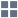

# Переменные сценария

В левом верхнем углу области построения сценариев располагаются [порты](../ports/README.md) переменных сценария:

*  "Переменные" — итоговый набор всех нижеперечисленных переменных сценария. Переменные не доступны для редактирования;
*  "Переменные системы" — набор переменных окружения операционной системы. Считываются из настроек системы. Переменные не доступны для редактирования;
* . Переменные не доступны для редактирования;
* . Переменные не доступны для редактирования;
*  "Переменные пользователя" — набор переменных, задаваемый пользователем для текущего сценария.
*  - Вызов меню действий над портами переменных сценария. Используется при отладке сценария.

--------

**Примечание:** Внутри [подмодели](../../processors/control/submodel.md) так же имеется возможность использовать переменные сценария. Однако, порт "Переменные пользователя" в этом случае содержит собственный набор переменных, применимых только внутри подмодели.

--------

Меню действий содержит следующие команды:

*  "Запуск обработки" — ручная активация портов (активированный порт содержит данные).

*  "Настройка" — открывает диалог настройки значений переменных пользователя.

*  "Настройка визуализаторов" — открывает диалог настройки визуализаторов.

*  "Другие действия" — вызывает контекстное меню с расширенным набором команд.

Для вызова контекстного меню порта необходимо кликнуть мышью порт. Контекстное меню содержит команды:

*  "Быстрый просмотр" — вызывает окно просмотра значений переменных. Команда доступна после активации порта;

*  "Настроить порт" — открывает диалог настройки значений переменных;

*  "Редактировать метки порта" — открывает диалог редактирования метки порта.

Переменная с одинаковым именем может присутствовать одновременно в нескольких портах. Для исключения конфликтов используется следующий приоритет:

1. Переменные пользователя;
2. Переменные пакета;
3. Переменные сессии;
4. Переменные системы.

Таким образом, переменные пользователя имеют наивысший приоритет. Пример:

* Переменная системы USERNAME="PC-01$"

* Переменная пользователя USERNAME="Иванов"

Итоговый набор в порту "Переменные" содержит перечень всех переменных, их значения вычислены с учетом вышеизложенного приоритета. Значение переменной USERNAME в ней будет равно "Иванов".
