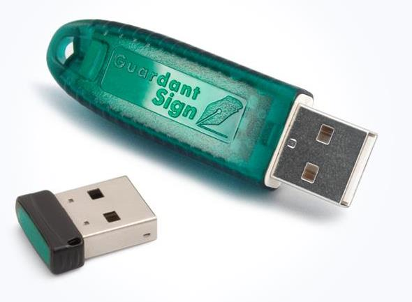

# Лицензионные ключи

Лицензионные ключи предназначены для защиты от нелицензионного копирования, применяются только с коммерческими версиями Loginom.

Типы ключей представлены в следующей таблице:

| Тип | Вид | Вариант исполнения |
|:------------------------------|:----------------|:--------------------|
| [Аппаратный USB-ключ защиты](#apparatnyy-usb-klyuch-zaschity) | [Локальный ключ](#lokalnyy-klyuch) | Стандартный |
|  |  | Микро |
|  | [Сетевой ключ](#setevoy-klyuch) | Стандартный |
| [Программный SP-ключ защиты](#programmnyy-sp-klyuch-zaschity) |  | &nbsp; |

## Аппаратный USB-ключ защиты

USB-ключ — рекомендуется для использования единичных экземпляров Loginom на серверах с физическим доступом к usb портам. Требует установки драйверов Guardant версии не ниже 7.0

### Локальный ключ

#### Особенности

* Должен быть вставлен в USB-порт того компьютера, на котором будет запускаться Loginom;
* Привязка программного обеспечения осуществляется не к параметрам компьютера, а только к ключу;
* Loginom может запускаться только там, где установлен ключ;
* Loginom *не работает* при подключении к системе в режиме RDP-сессии.

#### Достоинства

* Работает более стабильно и надежно;
* Не может произойти ситуация блокировки лицензии из-за того, что пользователь на другой машине не закрыл приложение Loginom;
* Для работы локального ключа необходимо установить только драйвер, тогда как при использовании сетевого ключа нужен выделенный сервер, на который необходимо проинсталлировать сервер ключей.

### Сетевой ключ

Сетевой ключ — рекомендуется для использования большого количества экземпляров Loginom в локальной сети. Требует развертывания сервера сетевых ключей версии не ниже 7.0.

#### Особенности

* Должен быть установлен на выделенном сервере, на котором необходимо дополнительно проинсталлировать сервер ключей;
* Лицензии конкурентные, то есть ограничивается количество компьютеров (или сессий терминала), на которых запущены приложения Loginom.

#### Достоинства

* Для работы Loginom нет необходимости устанавливать драйвер на каждую машину, достаточно просто инсталлировать программу;
* Конкурентные лицензии позволяют приобретать меньшее количество ПО в связи с тем, что количество одновременно запущенных приложений ограничивается. Это особенно удобно при работе в корпоративной сети, так как чаще всего Loginom запускают сразу не все пользователи, у которых он установлен.

### Варианты исполнения

#### Локальный ключ

Для локального ключа доступны два варианта физического исполнения: стандартный и микро.

#### Сетевой ключ

Сетевой ключ доступен только в стандартном исполнении.

## Программный SP-ключ защиты

Программный ключ — рекомендуется для использования единичных экземпляров Loginom в виртуальных средах без физического доступа к usb портам.

[Активация SP-ключей.pdf](./files/activation-SP-keys.pdf).

## Обновление ключей

Необходимость перепрограммирования ключа возникает при покупке дополнительных лицензий на компоненты или опции Loginom, — в этом случае выполняется дистанционное изменение содержимого памяти ключа с обменом специальными кодами по электронной почте.

[Обновление usb-ключа.pdf](./files/update-usb-key.pdf).