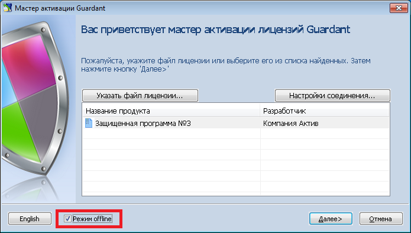
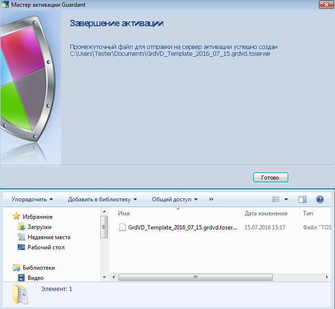
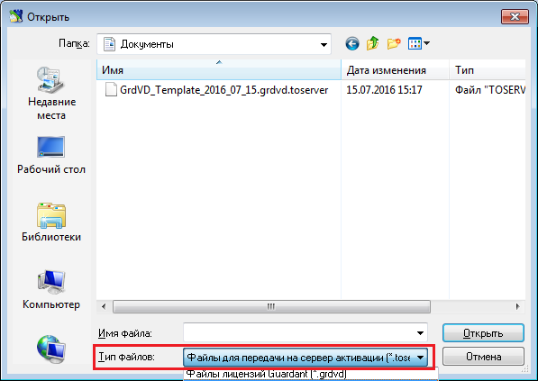
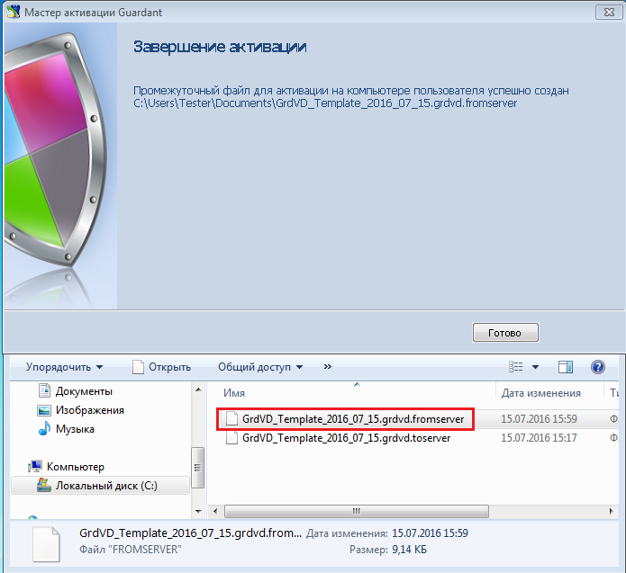
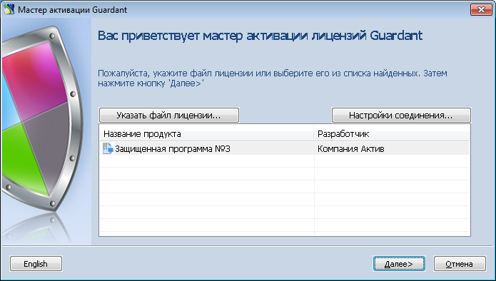
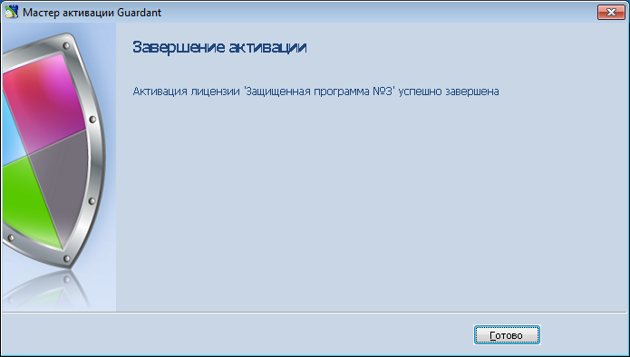

# Активация Guardant SP-ключа для систем без интернета

При недоступности в момент активации SP-ключа сети интернет (online-режим) для компьютера конечного пользователя существует [возможность активации в offline-режиме](https://dev.guardant.ru/pages/viewpage.action?pageId=1278815). Для этого необходимо выполнить ряд действий.

Запустить Мастер активации Guardant (GuardantActivationWizard.exe), установить опцию __Режим offline__ (внизу слева) и нажать кнопку __Далее__:

 
Ввести серийный номер программного ключа. После этого программа сгенерирует специальный файл для отправки на сервер активации:

Этот файл необходимо перенести на компьютер, где есть доступ в интернет, запустить
Мастер активации (GuardantActivationWizard.exe), нажать кнопку __Указать файл лицензии…__ и в выпадающем списке окна навигации указать в поле __Тип файлов:__ параметр __Файлы для передачи на сервер активации (*toserver)__:
 

Программа соединится с сервером активации и сгенерирует еще один файл, который нужно перенести на компьютер конечного пользователя для завершения активации:

На компьютере конечного пользователя запустить Мастер активации (GuardantActivationWizard.exe), нажать кнопку __Указать файл лицензии__ и, в открывшемся диалоге выбора файлов, указав тип файла __Файлы, полученные с сервера активации (*.fromserver)__ выбрать нужный файл:

Нажать кнопку __Далее__:

Процесс активации завершен:

