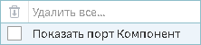
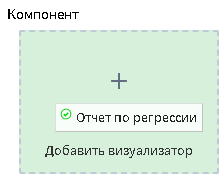

# Визуализация

Визуализатор представляет из себя инструмент, позволяющий пользователю выбрать удобный вариант отображения данных.

Визуализаторы:

*  **Диаграмма** — графическое представление данных;
*  **Куб** — многомерное представление данных;
*  **Таблица** — табличное представление данных;
* **Конечные классы** — результаты процедуры оптимального квантования в виде начальных и конечных классов, а также WoE-диаграммы и значений информационных индексов IV;
* **Отчет по регрессии** — статистические параметры и результаты статистических тестов для анализа регрессионных моделей.

## Работа с визуализаторами

* Для добавления визуализатора к узлу сценария требуется нажать кнопку  "Настройка визуализаторов". В открывшемся окне слева находится дерево доступных визуализаторов, справа — список выходных портов узла, данные которых можно визуализировать.
* Для добавления визуализатора к порту, надо выбрать в дереве необходимый визуализатор и нажать кнопку "Добавить" у нужного выходного порта. Также это можно сделать, перетащив мышкой необходимый визуализатор в область кнопки "Добавить" у нужного выходного порта.
* Для включения возможности использования специализированных визуализаторов необходимо в свободном пространстве области добавления визуализаторов нажать правую кнопку мыши и в открывшемся окне выбрать пункт "Показать порт Компонент" (см. рисунок 1).
* Для удаления визуализатора необходимо нажать кнопку  в правом верхнем углу визуализатора.

После включения порта появится возможность добавлять специализированные визуализаторы (см. рисунок 2).

>**Важно:** Данные не каждого порта возможно отобразить выбранным визуализатором. Если какой-либо визуализатор не поддерживается портом, то он добавлен не будет.