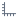

#  Диаграмма

## Описание

Диаграмма визуально отображает зависимость значений одного поля от другого. Наиболее часто используемый вид диаграмм — двумерный график. По горизонтальной его оси откладываются значения независимого столбца, а по вертикальной — соответствующие им значения зависимого столбца.

## Интерфейс

### Навигация

Навигация по диаграмме и ее настройка осуществляется при помощи мышки.

### Операции

*  **Настройка полей** — показать/скрыть список полей набора данных.
*  [Общие настройки](./general-settings.md) — настройки диаграммы в целом.
*  [Настройки серий](./series-settings.md) — настройки списка серий и параметров конкретных серий (графиков).
*  [Настройки осей](./axis-settings.md).
*  **Анимация** — обновление данных отображается плавно.
*  **Нормировать** — приводит все графики к одному масштабу.
*  **Навигатор** — позволяет детализировать по оси X какой-либо участок диаграммы, отображается снизу под осью. Передвигая край навигатора, можно выбрать необходимую область диаграммы.
*  **Повернуть график** — меняет местами оси, то есть поле по X перемещается на ось Y, и наоборот ось Y становится осью X.
*  **Приблизить** — приближает/увеличивает область диаграммы.
*  **Отдалить** — отдаляет/уменьшает область диаграммы.
*  **Сбросить приближение** — снимает все настройки приближения (по обеим осям).
*  **Сбросить приближение Y** — снимает приближение диаграммы по оси Y, но оставляет приближение по оси X.
*  **Экспорт** — позволяет сохранить диаграмму, как она выглядит в окне просмотра в файл с изображением. В данном пункте меню будет отображаться название того формата, который выбран для экспорта:
  * Экспорт в SVG;
  * Экспорт в PNG;
  * Экспорт в JPG;
  * Экспорт  в PDF.

### Настройка диаграммы

В левом списке отображаются поля, которые можно использовать в качестве осей диаграммы. Для этого необходимо, удерживая левой кнопкой мыши, перетащить (Drag&Drop) нужные поля в область построения диаграммы: в верхнюю часть — задается ось Y; в нижнюю часть — ось X. При задании оси Y происходит настройка добавления серии, а именно:

* Тип — задается тип диаграммы.
* Название — название серии (т.е. конкретного графика). Данное название будет отображаться в легенде диаграммы.
* Поле Y — задается поле для оси Y.
* Поле цвета — числовое поле, которое проецируется на цветовую шкалу.

При задании настроек оси X можно также воспользоваться кнопками в списке полей (справа от названия поля):

*  Использовать как поле абсцисс (CTRL+X);
*  Использовать как поле меток (Alt+L).

Таким образом, поле значений оси X и поле меток (обозначений делений оси) необязательно должны совпадать.

Доступны следующие типы диаграмм:

*  Линии;
*  Области;
*  Сплайны;
*  Столбчатая;
*  Области с интервалами;
*  Сглаженные области;
*  Сглаженные области с интервалами;
*  Пузырьковая;
*  Разброс;
*  Водопад;
*  Ошибки;
*  Полигон;
*  Столбчатая с интервалами;
* Тепловая карта;
* Японские свечи;
* OHLC.

Все основные настройки осуществляются либо через пункты контекстного меню (нажать правой кнопкой мыши в области диаграммы), либо с помощью кнопок на панели инструментов (сверху над диаграммой). Описание настроек диаграммы приведено выше в данной статье.

### Работа с построенной диаграммой

При работе с диаграммой предусмотрена возможность увеличения масштаба просмотра всей диаграммы или ее произвольной области. Для этого на панели инструментов нужно сделать активным  режим приближения и далее следует, удерживая левую кнопку мыши нажатой, выделить ту область диаграммы, которую нужно просмотреть более детально. Как только кнопка мыши будет отпущена, масштаб просмотра выделенной области будет увеличен. Для дальнейшего увеличения масштаба данную процедуру можно повторить. Чтобы детальнее рассмотреть диаграмму при заданном увеличении, необходимо сделать активным  режим перетаскивания. Это позволит передвигать диаграмму по экрану.

Чтобы вернуться к исходному масштабу диаграммы, нужно воспользоваться  — сбросить приближение.